# Smart Tennis Field

Master Thesis Project — Politecnico di Torino
Docker-based IoT, time-series, and AI processing pipeline

---

## Overview

Dockerized, event-driven IoT architecture for ingesting, storing, and processing multi-sensor data in a reproducible and measurable way.

```text
Data -> Broker -> Storage -> Processing -> Storage -> API
```



---

## Services

| Service              | Role                                            | Status        |
| -------------------- | ----------------------------------------------- | ------------- |
| `emqx`               | MQTT broker                                     | Stable        |
| `ingest-service`     | MQTT consumer, normalization, batch persistence | Stable        |
| `influxdb3`          | Time-series database                            | Stable        |
| `influxdb3-explorer` | Explorer UI for schema and query inspection     | Stable        |
| `siddha-sensor-sim`  | Dataset-driven MQTT simulator                   | Stable        |
| `har-service`        | Activity recognition processor                  | Current phase |

---

## Documentation

| Document                                      | Purpose                                                  |
| --------------------------------------------- | -------------------------------------------------------- |
| [Architecture.md](docs/Architecture.md)       | Components, data model, design decisions, identity model |
| [DatasetContract.md](docs/DatasetContract.md) | Dataset mapping rules: Parquet → MQTT → InfluxDB         |
| [Phases.md](docs/Phases.md)                   | Roadmap and thesis direction                             |
| [Journal.md](docs/Journal.md)                 | Development narrative and lessons learned                |

---

## Project Structure

```text
docs/
  Architecture.md
  DatasetContract.md
  Phases.md
  Journal.md
  smart_tennis_field_iot_pipeline.svg

services/
  ingest_service/
  siddha_sensor_sim/
  har_service/        # next phase

dataset/
  data.parquet

docker-compose.yml
.env.example
README.md
```

Each service has its own Dockerfile. The dataset is mounted via Docker, not baked into containers.

---

## Quickstart

### 1. Start the system

```bash
docker compose up -d --build
```

### 2. Create an InfluxDB admin token

```bash
docker exec -it influxdb3 influxdb3 create token --admin
```

### 3. Configure `.env`

.env.example is an example of how .env file should be. You can copy it to .env and modify it.

### 4. Restart after changing `.env`

```bash
docker compose up -d
```

### 5. Open the dashboards

- EMQX Dashboard: `http://localhost:18083`
- InfluxDB 3 Explorer: `http://localhost:8888`
- Ingest API: `http://localhost:8000`

---

## Endpoints

| Service             | URL                      |
| ------------------- | ------------------------ |
| EMQX Dashboard      | `http://localhost:18083` |
| InfluxDB 3          | `http://localhost:8181`  |
| InfluxDB 3 Explorer | `http://localhost:8888`  |
| Ingest API          | `http://localhost:8000`  |

### Docker Networking

- Inside Docker: use service names (`emqx:1883`, `influxdb3:8181`)
- From host machine: use `localhost` with mapped ports (`localhost:2883`, `localhost:8181`)

---

## API

### Health

- `GET /health` — service readiness and configuration state

### Events

- `GET /events` — query normalized event history (InfluxDB or memory fallback)
- `POST /publish` — publish a test payload to MQTT

### Structured IMU

- `GET /imu` — query raw IMU rows with filters: `device`, `recording_id`, `activity_gt`, time range, ordering. For Siddha replay, `recording_id` is a derived value like `A_11`, not the raw numeric `id`.

### Operational

- `GET /devices` — list distinct device values in `imu_raw`
- `GET /stats` — summary of event count, IMU count, and per-device counts
- `GET /events/schema` — inspect schemas for `events` and `imu_raw`

---

## MQTT Access

From the host machine: `localhost:2883`

---

## Operational Verification

After startup:

1. `GET /health`
2. Open InfluxDB Explorer at `http://localhost:8888`, connect to `http://localhost:8181`
3. `GET /events/schema`
4. `GET /stats`
5. `GET /imu?limit=20&order_by=dataset_ts&order_dir=asc`

---

## Security Notes

- Do not hardcode InfluxDB tokens in source files
- Keep secrets in `.env` and never commit real tokens
- All query parameters used in SQL construction are validated using strict allowlists to prevent SQL injection
- Timestamp parameters are validated as ISO-8601 before interpolation
- Internal services communicate via Docker service names

---

## Troubleshooting

### InfluxDB errors

- Verify `INFLUX_TOKEN` is set and valid
- Verify `INFLUX_DATABASE` exists
- Database names must use only letters, numbers, underscores, or hyphens
- `HTTP 400: partial write` usually indicates a schema conflict (field vs tag mismatch)

### MQTT issues

```bash
docker compose logs emqx ingest-service
```

### Explorer connectivity

- From host browser: `http://localhost:8181`
- From containers: `http://influxdb3:8181`

### Low throughput

- Increase `INFLUX_BATCH_SIZE`
- Decrease `INFLUX_FLUSH_INTERVAL_MS`
- Use QoS 1 with `SIDDHA_MQTT_WAIT_FOR_PUBLISH=true` for reliable runs

### Data loss

- QoS 0 does not guarantee delivery
- Use `SIDDHA_MQTT_WAIT_FOR_PUBLISH=true` for strict runs
- The ingest service uses bounded retries for failed batch writes. If failures persist beyond the retry limit, lines are dropped and counted. Check `/health` for `failed_batch_count` and `dropped_line_count`
- Inspect ingest logs for batch write errors
- Current Siddha replay uses a derived session identifier (`<activity>_<id>`) to separate labeled sampling sessions. `sample_idx` is preserved as a field for inspection and future schema evolution.

---

## Current Status

| Component                   | Status      |
| --------------------------- | ----------- |
| MQTT infrastructure         | Stable      |
| Ingest service              | Stable      |
| Dataset validation pipeline | Completed   |
| Batch writer                | Implemented |
| HAR service                 | Next        |
