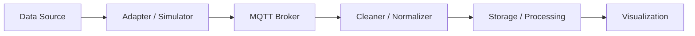
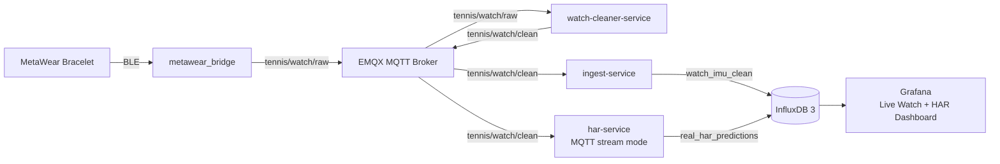
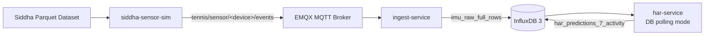
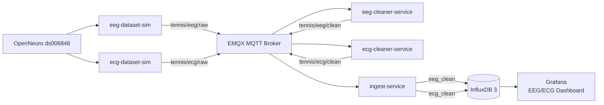

# Smart Tennis Field — IoT Sensor Pipeline + Live HAR

Smart Tennis Field is a Docker-based IoT thesis project for collecting, cleaning, storing, processing, and visualizing wearable and dataset-based sensor streams. It validates a microservice architecture for MetaWear watch ingestion, ONNX human activity recognition (HAR), Siddha dataset replay, EEG/ECG dataset fake sensors, InfluxDB storage, and Grafana visualization.

## Phase Status

| Phase | Status | Result |
|---|---|---|
| Phase 0 | Completed | EMQX MQTT broker validated |
| Phase 1 | Completed | Ingest-service and InfluxDB storage |
| Phase 2 | Completed | Siddha dataset replay stored in InfluxDB |
| Phase 3 | Completed | ONNX HAR service with DB polling mode |
| Phase 4 | Completed | Real MetaWear watch pipeline and live HAR |
| Phase 5 | Completed | Grafana dashboard from InfluxDB |
| Phase 6 | Completed | EEG/ECG dataset fake sensors and storage |

## Architecture

The project follows a modular IoT pipeline:


```mermaid
flowchart LR
    DS[Data Source] --> AD[Adapter / Simulator]
    AD --> MQTT[MQTT Broker]
    MQTT --> CL[Cleaner / Normalizer]
    CL --> ST[Storage / Processing]
    ST --> VIS[Visualization]
```

## Implemented Data Flows

### Real Watch + HAR


```mermaid
flowchart LR
    MW[MetaWear Bracelet] -->|BLE| MB[metawear_bridge]
    MB -->|tennis/watch/raw| EMQX[EMQX MQTT Broker]
    EMQX -->|tennis/watch/raw| WC[watch-cleaner-service]
    WC -->|tennis/watch/clean| EMQX

    EMQX -->|tennis/watch/clean| ING[ingest-service]
    ING -->|watch_imu_clean| DB[(InfluxDB 3)]

    EMQX -->|tennis/watch/clean| HAR[har-service<br/>MQTT stream mode]
    HAR -->|real_har_predictions| DB

    DB --> G[Grafana<br/>Live Watch + HAR Dashboard]
```

### Siddha Dataset Replay


```mermaid
flowchart LR
    SD[Siddha Parquet Dataset] --> SIM[siddha-sensor-sim]
    SIM -->|tennis/sensor/&lt;device&gt;/events| EMQX[EMQX MQTT Broker]
    EMQX --> ING[ingest-service]
    ING -->|imu_raw_full_rows| DB[(InfluxDB 3)]
    DB --> HAR[har-service<br/>DB polling mode]
    HAR -->|har_predictions_7_activity| DB
```

### EEG/ECG Fake Sensors


```mermaid
flowchart LR
    OD[OpenNeuro ds006848] --> EEGSIM[eeg-dataset-sim]
    OD --> ECGSIM[ecg-dataset-sim]

    EEGSIM -->|tennis/eeg/raw| EMQX[EMQX MQTT Broker]
    ECGSIM -->|tennis/ecg/raw| EMQX

    EMQX --> EEGC[eeg-cleaner-service]
    EMQX --> ECGC[ecg-cleaner-service]

    EEGC -->|tennis/eeg/clean| EMQX
    ECGC -->|tennis/ecg/clean| EMQX

    EMQX --> ING[ingest-service]
    ING -->|eeg_clean| DB[(InfluxDB 3)]
    ING -->|ecg_clean| DB

    DB --> G[Grafana<br/>EEG/ECG Dashboard]
```

## Services

| Service | Purpose |
|---|---|
| `emqx` | MQTT broker |
| `influxdb3` | Time-series database |
| `influxdb3-explorer` | InfluxDB web UI |
| `ingest-service` | Stores clean sensor data |
| `siddha-sensor-sim` | Replays Siddha IMU dataset |
| `metawear_bridge` | Local BLE-to-MQTT adapter for MetaWear |
| `watch-cleaner-service` | Cleans and pairs watch ACC/GYRO rows |
| `har-service` | Runs ONNX HAR inference |
| `grafana` | Visualizes stored sensor and prediction data |
| `eeg-dataset-sim` | Replays EEG samples from OpenNeuro |
| `eeg-cleaner-service` | Validates and normalizes EEG rows |
| `ecg-dataset-sim` | Replays ECG samples from OpenNeuro |
| `ecg-cleaner-service` | Validates and normalizes ECG rows |

## Requirements

- Docker Desktop and Docker Compose.
- Python 3.11 or newer.
- InfluxDB token.
- MetaWear bracelet for the live watch pipeline.
- OpenNeuro ds006848 dataset subset for Phase 6.

## Environment Setup

Create your local environment file:

```bash
cp .env.example .env
```

Set at least:

```env
INFLUX_TOKEN=YOUR_TOKEN_HERE
HAR_INFLUX_TOKEN=YOUR_TOKEN_HERE
METAWEAR_MAC_ADDRESS=YOUR_METAWEAR_MAC_ADDRESS

# Local MetaWear bridge on Windows
METAWEAR_MQTT_HOST=localhost
METAWEAR_MQTT_PORT=2883

# Docker services
MQTT_HOST=emqx
MQTT_PORT=1883

# Phase 6 defaults
EEG_MAX_SECONDS=600
ECG_MAX_SECONDS=600
EEG_DOWNSAMPLE_HZ=100
ECG_DOWNSAMPLE_HZ=100
INFLUX_EEG_TABLE=eeg_clean
INFLUX_ECG_TABLE=ecg_clean
```

## Quick Start

```bash
docker compose up -d emqx influxdb3 influxdb3-explorer ingest-service grafana
docker compose ps
curl http://localhost:8000/health
curl http://localhost:8000/stats
```

## Run Live Watch + HAR

Start backend services:

```bash
docker compose up -d emqx influxdb3 influxdb3-explorer ingest-service watch-cleaner-service har-service grafana
```

Run the MetaWear bridge locally:

```bash
cd services/metawear_bridge
python -m venv .venv
.venv\Scripts\activate
pip install -r requirements.txt
python -m app.bridge
```

Check logs:

```bash
docker compose logs -f watch-cleaner-service
docker compose logs -f ingest-service
docker compose logs -f har-service
```

## Run Siddha Replay

Place the Siddha dataset at `dataset/data.parquet`, then run:

```bash
docker compose up -d emqx influxdb3 ingest-service
docker compose --profile replay up siddha-sensor-sim
```

Check stored rows:

```sql
SELECT COUNT(*) AS n FROM imu_raw_full_rows;
```

## Run EEG/ECG Phase 6

Place the OpenNeuro dataset at `dataset/openneuro_ds006848/`.

```bash
python3 reset_phase6_tables.py
docker compose --profile phase6 build
docker compose --profile phase6 up -d eeg-cleaner-service ecg-cleaner-service
docker compose --profile phase6 up -d eeg-dataset-sim
docker compose --profile phase6 up -d ecg-dataset-sim
```

Check logs:

```bash
docker compose logs -f eeg-dataset-sim
docker compose logs -f ecg-dataset-sim
docker compose logs -f eeg-cleaner-service
docker compose logs -f ecg-cleaner-service
docker compose logs -f ingest-service
```

Expected default Phase 6 validation with 600 seconds at 100 Hz:

| Table | Expected rows |
|---|---:|
| `eeg_clean` | about 60,000 |
| `ecg_clean` | about 60,000 |

```sql
SELECT COUNT(*) AS n FROM eeg_clean;
SELECT COUNT(*) AS n FROM ecg_clean;
```

## Dashboards

| Tool | URL | Login |
|---|---|---|
| Grafana | `http://localhost:3000` | `admin` / `admin` |
| InfluxDB Explorer | `http://localhost:8888` | token from `.env` |

Provisioned dashboard:

```text
Smart Tennis Field - Live Dashboard
```

## API Endpoints

FastAPI documentation is available at:

```text
http://localhost:8000/docs
```

| Endpoint | Purpose |
|---|---|
| `GET /health` | Service and writer health |
| `GET /stats` | Row counts and ingest queue metrics |
| `GET /tables` | Configured InfluxDB table names |
| `GET /schema` | Table schemas |
| `GET /devices` | Known devices across sensor tables |
| `GET /sensors/imu` | Siddha dataset IMU rows |
| `GET /sensors/watch` | Real watch clean IMU rows |
| `GET /sensors/eeg` | EEG fake-sensor rows |
| `GET /sensors/ecg` | ECG fake-sensor rows |

## Architecture Diagrams

Detailed diagrams are available in [`docs/diagrams`](docs/diagrams):

| Diagram | Purpose |
|---|---|
| [`01-system-overview`](docs/diagrams/01-system-overview.md) | Full project architecture |
| [`02-docker-compose-topology`](docs/diagrams/02-docker-compose-topology.md) | Docker services and profiles |
| [`03-watch-pipeline`](docs/diagrams/03-watch-pipeline.md) | Real MetaWear watch pipeline |
| [`04-siddha-dataset-pipeline`](docs/diagrams/04-siddha-dataset-pipeline.md) | Siddha replay and HAR DB mode |
| [`05-eeg-ecg-fake-sensor-pipeline`](docs/diagrams/05-eeg-ecg-fake-sensor-pipeline.md) | Phase 6 fake-sensor extension |
| [`06-data-ownership-and-storage`](docs/diagrams/06-data-ownership-and-storage.md) | Table ownership and storage separation |
| [`07-grafana-observability`](docs/diagrams/07-grafana-observability.md) | Two Grafana dashboards |

## Documentation

- [Architecture](docs/Architecture.md)
- [Dataset contract](docs/DatasetContract.md)
- [Phases](docs/Phases.md)
- [Results](docs/Result.md)
- [Phase 4 validation](docs/Validation/phase4_validation_report.md)
- [Phase 5 Grafana validation](docs/Validation/phase5_grafana_validation_report.md)

## Scope Notes

- EEG/ECG ML is not implemented.
- The HAR model is not tennis-specific.
- Clean sensor data and predictions are stored separately.
- Grafana uses InfluxDB as the source of truth.
- This project is validated for thesis-scale live testing, not production deployment.
