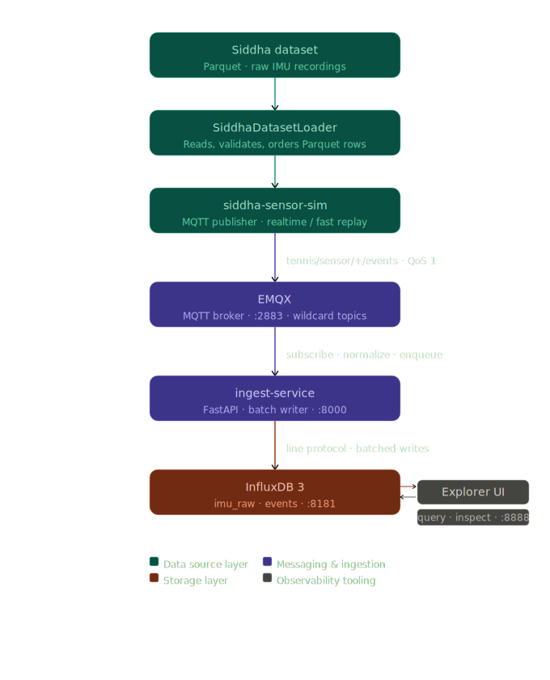

# Smart Tennis Field — System Architecture

## 1. Overview

The system follows a distributed, event-driven microservice architecture:

```text
Data -> Broker -> Storage -> Processing -> Storage -> API
```

Producers, ingestion, and processing are fully decoupled. The full system runs reproducibly via Docker Compose, and each stage can be measured independently.



---

## 2. Components

### 2.1 EMQX (MQTT Broker)

Event transport layer. Routes all sensor messages and supports wildcard topic subscriptions.

Topics:

```text
tennis/sensor/<device>/events
tennis/camera/<id>/ball
```

### 2.2 siddha-sensor-sim (Dataset Simulator)

Simulated sensor producer using the Siddha dataset. Reads Parquet data, publishes IMU samples as MQTT events, and supports `realtime` and `fast` replay modes with deterministic ordering.

The simulator exists so that real data flows through the broker and ingest pipeline, preserving the architectural contribution over direct database loading.

### 2.3 ingest-service (FastAPI Microservice)

Bridge between MQTT and database. Responsibilities:

- Subscribe to MQTT topics using wildcard patterns
- Normalize incoming messages into event envelopes
- Store recent events in memory for debugging
- Route payloads into generic event storage (`events`) and structured IMU storage (`imu_raw`)
- Enqueue line protocol writes into a batch writer thread

### 2.4 InfluxDB 3

Time-series storage layer. Stores structured IMU data and generic event logs.

### 2.5 InfluxDB 3 Explorer

Query and inspection UI for manual debugging and schema validation.

---

## 3. Data Model

### 3.1 Dual Persistence

The ingest layer maintains two parallel storage paths:

| Layer | Measurement | Purpose |
| --- | --- | --- |
| Event layer | `events` | Generic logging, debugging, full payload trace |
| Signal layer | `imu_raw` | Structured IMU data for ML processing |

### 3.2 `imu_raw` Schema

Tags:

- `device`
- `recording_id`

Fields:

- `sample_idx`
- `acc_x`, `acc_y`, `acc_z`
- `gyro_x`, `gyro_y`, `gyro_z`
- `dataset_ts`
- `activity_gt` (metadata, not part of point identity)

Timestamp:

- Derived from `dataset_ts`: `base_epoch_ns (2024-01-01T00:00:00Z) + dataset_ts_in_nanoseconds`

For Siddha replay, `recording_id` is not the raw dataset `id`. It is a derived session identifier built as `<activity>_<id>` (for example `A_11`). This avoids ambiguity between labeled Siddha sessions that reuse the same raw `id` across different activities.

Example line protocol:

```text
imu_raw,device=phone,recording_id=A_11 sample_idx=2i,acc_x=...,acc_y=...,acc_z=...,gyro_x=...,gyro_y=...,gyro_z=...,dataset_ts=12.35,activity_gt="A" 1704067212350000000
```

### 3.3 `events` Schema

Tags: `stream`, `source_id`
Field: `payload` (escaped JSON string)
Timestamp: normalized event timestamp converted to epoch nanoseconds

---

## 4. Timestamp Semantics

The system uses three distinct time concepts plus one identity dimension:

| Name | Meaning | Source | Used for |
| --- | --- | --- | --- |
| `dataset_ts` | Original signal time inside the Siddha recording | Parquet dataset | Signal ordering, HAR windows |
| `ts` | Wall-clock publish timestamp | Simulator at MQTT publish time | Transport tracing, latency analysis |
| `time` | InfluxDB point timestamp | Derived from `dataset_ts` by ingest service | Storage ordering |
| `sample_idx` | Duplicate-order index within a timestamp group | Dataset loader | Inspection, replay analysis, future identity strengthening |

These values serve different purposes and are not interchangeable.

---

## 5. Data Identity Model

### 5.1 The Problem

The Siddha dataset can reuse the same raw `id` across different activities, and multiple samples can also share the same logical timestamp within a session. A Siddha-specific session identifier was therefore derived so that replay and storage are keyed by labeled session rather than raw dataset `id`.

### 5.2 Current Storage Identity

Under the current Siddha replay configuration, InfluxDB point identity is determined by:

```text
(measurement, device, recording_id, time)
```

where:

- `recording_id = <activity>_<id>`
- `time` is derived from `dataset_ts`

`sample_idx` is still computed and stored as a field for inspection and future extensibility, but it is not currently part of point identity.

This design assumes that the tuple `(device, activity, id, dataset_ts)` is unique for the validated Siddha replay configuration.

### 5.3 Preserved Duplicate-Order Metadata

An explicit duplicate-order index (`sample_idx`) is still assigned per group during dataset loading:

- `0` -> first sample at a given timestamp
- `1` -> second sample
- `...`

`sample_idx` is preserved as an explicit duplicate-order field so that it can be promoted back to a tag if future datasets or real-time scenarios require stronger point disambiguation.

### 5.4 Why Explicit Indexing Over Timestamp Offsets

An earlier iteration considered nanosecond offsets to prevent collisions. That approach was rejected because:

- It introduces artificial time distortion
- It hides the real structure of the data
- It makes debugging harder

Explicit indexing preserves semantic time, makes identity visible, and aligns with time-series modeling best practices.

---

## 6. Batch Writer Design

**Problem:** One HTTP write per MQTT message is too slow for high-throughput replay.

**Solution:** Incoming writes are enqueued and flushed from a background writer thread, controlled by `INFLUX_BATCH_SIZE` and `INFLUX_FLUSH_INTERVAL_MS`.

This decouples MQTT consumption from persistence and significantly improves throughput.

### Failure Handling

Write failures are handled with bounded retry logic. Failed batches are re-enqueued with a retry counter. After exceeding a maximum retry threshold, data is dropped and reported.

This prevents silent data loss while avoiding infinite retry loops.

### Runtime Metrics

The batch writer exposes runtime metrics:

- `queue_depth` — current number of lines waiting to be written
- `failed_batch_count` — total batches that failed at least once
- `retried_line_count` — total lines re-enqueued for retry
- `dropped_line_count` — total lines dropped after exceeding max retries

These are available via `/health` and `/stats` endpoints and are used to validate ingestion reliability.

---

## 7. Data Integrity and Transport Reliability

These are two independent concerns:

| Concern | Risk | Mitigation |
| --- | --- | --- |
| Storage identity | Session ambiguity or timestamp collisions | Derived `recording_id` + validated `dataset_ts` uniqueness |
| Transport delivery | MQTT QoS 0 drops messages under load | QoS 1 + `wait_for_publish` |
| Write throughput | Per-message HTTP writes bottleneck | Batch writer |
| Broker overload | Ingest slower than publish rate | Batching + QoS tuning |

### Validated Configurations

| Replay Mode | QoS | Wait for Publish | Result |
| --- | --- | --- | --- |
| `fast` | 0 | `false` | Data loss observed |
| `fast` | 1 | `true` | Correct ingestion |
| `realtime` | 0 | `false` | Correct ingestion |
| `realtime` | 1 | `true` | Correct ingestion |

Recommended for batch validation runs: `fast` + QoS 1 + `wait_for_publish=true`.

---

## 8. Design Decisions

### 8.1 Structured vs JSON Storage

| Option | Pros | Cons |
| --- | --- | --- |
| JSON-only | Simple | Not queryable for ML |
| Structured numeric | SQL-queryable, ML-ready | More design effort |

Structured storage was selected because HAR processing requires direct numeric access to sensor channels.

### 8.2 Microservice Separation

Ingestion and processing are separate services so that each can be developed, tested, and scaled independently. This also makes thesis evaluation clearer by isolating concerns.

### 8.3 Separation of Concerns

| Concern | Mechanism |
| --- | --- |
| Semantic time | `dataset_ts` field |
| Session identity | Derived `recording_id` tag |
| Duplicate-order visibility | `sample_idx` field |
| Storage ordering | InfluxDB `time` |
| Transport reliability | MQTT QoS + `wait_for_publish` |

---

## 9. Security Considerations

- InfluxDB tokens are stored in `.env` and never hardcoded
- All query parameters used in SQL construction are validated using strict allowlists (alphanumeric, underscore, hyphen) to prevent SQL injection
- Timestamp parameters are validated as ISO-8601 before interpolation
- Table and measurement names from environment variables are validated at startup
- Internal services communicate via Docker service names
- Only necessary ports are exposed during development
