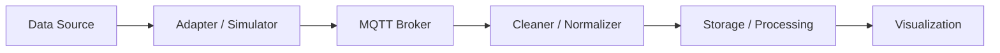
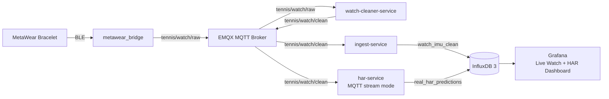
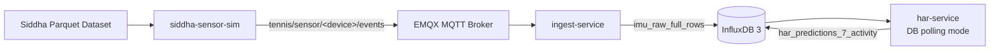
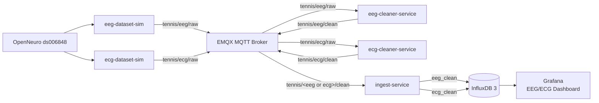
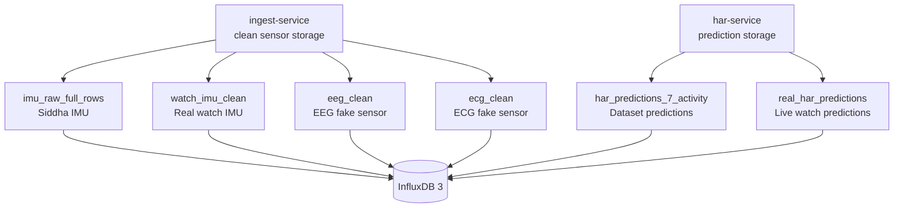
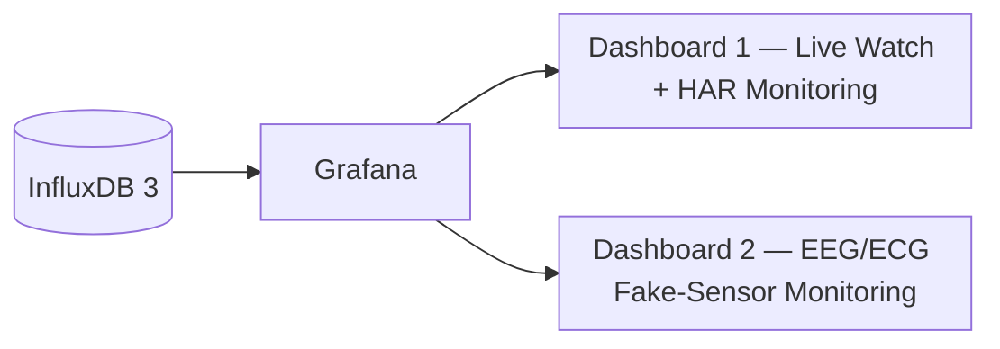

# Smart Tennis Field — System Architecture

## 1. Architecture Summary

Smart Tennis Field is a Docker-based IoT microservice system for wearable sensor ingestion, dataset replay, activity recognition, time-series storage, and Grafana visualization.

The final architecture follows this pattern:


```mermaid
flowchart LR
    DS[Data Source] --> A[Adapter / Simulator]
    A --> B[MQTT Broker]
    B --> C[Cleaner / Normalizer]
    C --> S[Storage / Processing]
    S --> V[Visualization]
```

This separation keeps protocol adaptation, cleaning, ingestion, machine learning, storage, and visualization independent. Each service has a narrow responsibility, which makes the system easier to validate, observe, and extend.

## 2. Implemented System Context

| Phase | Status | Main Result |
|---|---|---|
| Phase 0 | Completed | EMQX MQTT broker validated |
| Phase 1 | Completed | FastAPI ingest-service + InfluxDB persistence |
| Phase 2 | Completed | Siddha dataset replay pipeline |
| Phase 3 | Completed | ONNX HAR service with DB polling mode |
| Phase 4 | Completed | Real MetaWear watch pipeline + live HAR mode |
| Phase 5 | Completed | Grafana dashboards from InfluxDB |
| Phase 6 | Completed | EEG/ECG dataset fake sensors, storage, and visualization |

The final project supports three main data paths:

- Real MetaWear watch monitoring with HAR inference.
- Siddha dataset replay for reproducible IMU/HAR validation.
- OpenNeuro EEG/ECG fake-sensor replay for multi-source extensibility.

## 3. Microservice Responsibilities

| Service | Responsibility |
|---|---|
| `emqx` | MQTT broker for raw and clean sensor messages |
| `ingest-service` | Stores clean sensor data in InfluxDB |
| `siddha-sensor-sim` | Replays Siddha IMU dataset rows |
| `metawear_bridge` | Converts MetaWear BLE callbacks into MQTT raw events |
| `watch-cleaner-service` | Pairs and normalizes real watch ACC/GYRO samples |
| `har-service` | Runs ONNX HAR inference and writes predictions |
| `eeg-dataset-sim` | Replays EEG samples from OpenNeuro ds006848 |
| `eeg-cleaner-service` | Validates and normalizes EEG samples |
| `ecg-dataset-sim` | Replays ECG samples from OpenNeuro ds006848 |
| `ecg-cleaner-service` | Validates and normalizes ECG samples |
| `influxdb3` | Time-series storage |
| `grafana` | Visualization dashboards |

The main architectural rule is:

```text
ingest-service owns clean sensor storage.
har-service owns prediction storage.
```

This avoids turning the ingest-service into a monolithic writer for every possible output type.

## 4. Main Data Flows

### 4.1 Real Watch + HAR Pipeline


```mermaid
flowchart LR
    MW[MetaWear Bracelet] -->|BLE| MB[metawear_bridge]
    MB -->|tennis/watch/raw| EMQX[EMQX MQTT Broker]
    EMQX -->|tennis/watch/raw| WC[watch-cleaner-service]
    WC -->|tennis/watch/clean| EMQX

    EMQX -->|tennis/watch/clean| ING[ingest-service]
    ING -->|watch_imu_clean| DB[(InfluxDB 3)]

    EMQX -->|tennis/watch/clean| HAR[har-service<br/>MQTT stream mode]
    HAR -->|real_har_predictions| DB

    DB --> G[Grafana<br/>Live Watch + HAR Dashboard]
```

The MetaWear bracelet does not publish MQTT directly. The local bridge converts BLE sensor callbacks into raw MQTT messages. The cleaner validates and pairs accelerometer/gyroscope samples, then publishes canonical clean IMU rows. Clean rows are stored by the ingest-service and consumed by HAR in MQTT stream mode for live predictions.

### 4.2 Siddha Dataset Replay Pipeline


```mermaid
flowchart LR
    SD[Siddha Parquet Dataset] --> SIM[siddha-sensor-sim]
    SIM -->|tennis/sensor/&lt;device&gt;/events| EMQX[EMQX MQTT Broker]

    EMQX --> ING[ingest-service]
    ING -->|imu_raw_full_rows| DB[(InfluxDB 3)]

    DB --> HAR[har-service<br/>DB polling mode]
    HAR -->|har_predictions_7_activity| DB
```

The Siddha replay path is used for reproducible dataset-based validation. Rows are replayed through MQTT and stored in InfluxDB before HAR reads them in DB polling mode. This path is deterministic and useful for testing the storage and inference pipeline with known dataset labels.

### 4.3 EEG/ECG Fake-Sensor Pipeline


```mermaid
flowchart LR
    OD[OpenNeuro ds006848] --> EEGSIM[eeg-dataset-sim]
    OD --> ECGSIM[ecg-dataset-sim]

    EEGSIM -->|tennis/eeg/raw| EMQX[EMQX MQTT Broker]
    ECGSIM -->|tennis/ecg/raw| EMQX

    EMQX -->|tennis/eeg/raw| EEGC[eeg-cleaner-service]
    EMQX -->|tennis/ecg/raw| ECGC[ecg-cleaner-service]

    EEGC -->|tennis/eeg/clean| EMQX
    ECGC -->|tennis/ecg/clean| EMQX

    EMQX -->|tennis/&lt;eeg or ecg&gt;/clean| ING[ingest-service]
    ING -->|eeg_clean| DB[(InfluxDB 3)]
    ING -->|ecg_clean| DB

    DB --> G[Grafana<br/>EEG/ECG Dashboard]
```

Phase 6 extends the architecture with heterogeneous dataset-based physiological sources. EEG and ECG are replayed as fake sensors, cleaned through dedicated services, stored in separate InfluxDB tables, and visualized in Grafana. No EEG/ECG machine learning is implemented; the purpose is to prove extensibility.

## 5. Data Ownership and Storage


```mermaid
flowchart TB
    ING[ingest-service<br/>clean sensor storage]
    HAR[har-service<br/>prediction storage]
    DB[(InfluxDB 3)]

    ING --> T1[imu_raw_full_rows<br/>Siddha IMU]
    ING --> T2[watch_imu_clean<br/>Real watch IMU]
    ING --> T3[eeg_clean<br/>EEG fake sensor]
    ING --> T4[ecg_clean<br/>ECG fake sensor]

    HAR --> P1[har_predictions_7_activity<br/>Dataset predictions]
    HAR --> P2[real_har_predictions<br/>Live watch predictions]

    T1 --> DB
    T2 --> DB
    T3 --> DB
    T4 --> DB
    P1 --> DB
    P2 --> DB
```

Sensor data and prediction data are stored separately. This keeps model inputs and model outputs independent, makes debugging easier, and avoids duplicating full input windows inside prediction rows.

| Table | Producer | Purpose |
|---|---|---|
| `imu_raw_full_rows` | `ingest-service` | Siddha dataset IMU rows |
| `watch_imu_clean` | `ingest-service` | Clean MetaWear watch rows |
| `eeg_clean` | `ingest-service` | Clean EEG fake-sensor rows |
| `ecg_clean` | `ingest-service` | Clean ECG fake-sensor rows |
| `har_predictions_7_activity` | `har-service` | Dataset HAR predictions |
| `real_har_predictions` | `har-service` | Live watch HAR predictions |

## 6. HAR Service

The HAR service supports two execution modes: DB polling for Siddha dataset evaluation and MQTT streaming for live watch inference. See [Phases.md §7-8](Phases.md#7-phase-3--har-microservice) for implementation details.

## 7. Grafana Observability

The final visualization layer uses two Grafana dashboards.


```mermaid
flowchart LR
    DB[(InfluxDB 3)] --> G[Grafana]

    subgraph Dashboard_1["Dashboard 1 — Live Watch + HAR Monitoring"]
    end

    subgraph Dashboard_2["Dashboard 2 — EEG/ECG Fake-Sensor Monitoring"]
    end

    G --> Dashboard_1
    G --> Dashboard_2
```

The watch dashboard validates the real sensor and HAR path. The EEG/ECG dashboard validates multi-source extensibility. Both dashboards use InfluxDB as the source of truth, which keeps visualization tied to persisted data rather than transient MQTT messages.

## 8. Project Scope

For a complete list of implemented features and intentional limitations, see [Result.md §10 Final Limitations](Result.md#10-final-limitations).

The architecture is defensible because it provides:

- Separation of concerns: adapters, cleaners, ingestion, inference, and visualization are separate services.
- Reproducibility: Siddha and OpenNeuro data can be replayed through controlled simulators.
- Observability: queue depth, failed writes, stored row counts, predictions, and signals are visible.
- Extensibility: EEG/ECG sources were added without changing the watch pipeline or HAR ownership.
- Reliability: ingest-service uses bounded queues, batch writes, retries, and explicit drop counters.
- Honest scope control: EEG/ECG are used for storage and visualization only, not unsupported ML claims.

The project is validated for thesis-scale live testing, not production deployment.
