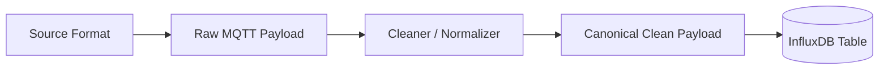
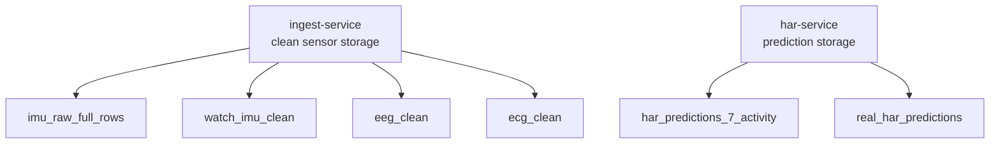
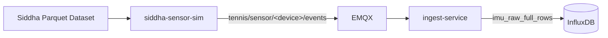
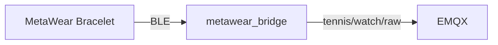
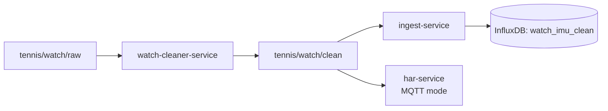
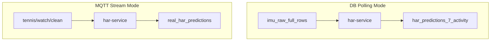
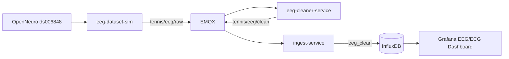
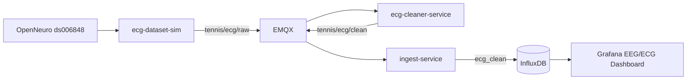
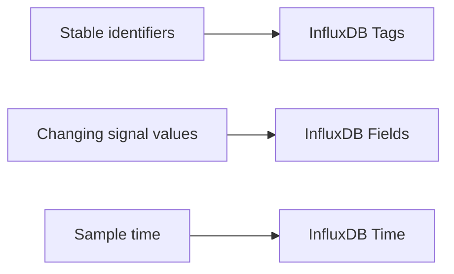

# Smart Tennis Field — Data Contracts

## 1. Purpose

This document defines the data contracts used by the Smart Tennis Field system.

A data contract describes:

- What a service receives.
- What a service publishes.
- What is stored in InfluxDB.
- Which fields are identifiers.
- Which fields are measured values.

The project uses four sensor/data families:

| Source | Type | Status | Main Table |
|---|---|---|---|
| Siddha dataset | IMU dataset replay | Implemented | `imu_raw_full_rows` |
| MetaWear bracelet | Real watch hardware | Implemented | `watch_imu_clean` |
| OpenNeuro EEG | Dataset fake sensor | Implemented | `eeg_clean` |
| OpenNeuro ECG | Dataset fake sensor | Implemented | `ecg_clean` |
| HAR service | Prediction output | Implemented | `real_har_predictions`, `har_predictions_7_activity` |

The general contract pattern is:



Raw data can be hardware-specific or dataset-specific. Cleaner services convert source-specific messages into canonical clean rows. The ingest-service stores clean sensor rows. The HAR service stores prediction rows.

## 2. Contract Ownership



The ingest-service owns sensor data storage. The HAR service owns prediction storage. Prediction rows are not routed through ingest-service because their schema is different from sensor rows.

## 3. Siddha IMU Dataset Contract

### 3.1 Source

The Siddha simulator reads a Parquet dataset containing IMU rows.

Required source columns:

| Column | Meaning |
|---|---|
| `device` | Source device, usually `phone` or `watch` |
| `activity` | Ground-truth activity code |
| `id` | Raw recording identifier |
| `timestamp` | Logical time inside the recording |
| `acc_x`, `acc_y`, `acc_z` | Accelerometer axes |
| `gyro_x`, `gyro_y`, `gyro_z` | Gyroscope axes |

### 3.2 Flow



Siddha rows are replayed through MQTT to validate the ingestion and storage pipeline with reproducible dataset data.

### 3.3 MQTT Topic

```text
tennis/sensor/<device>/events
```

Example:

```text
tennis/sensor/watch/events
```

### 3.4 Normalized Payload

```json
{
  "device": "watch",
  "recording_id": "F_0",
  "dataset_ts": 12.35,
  "sample_idx": 42,
  "acc_x": 0.1,
  "acc_y": -0.2,
  "acc_z": 9.7,
  "gyro_x": 0.01,
  "gyro_y": -0.02,
  "gyro_z": 0.03,
  "activity_gt": "F",
  "ts": "2026-05-20T10:15:31Z"
}
```

### 3.5 Field Meaning

| Field | Meaning |
|---|---|
| `device` | Dataset device name |
| `recording_id` | Stable recording identity, usually `<activity>_<id>` |
| `dataset_ts` | Time inside the original recording |
| `sample_idx` | Sample index used for debugging/order checks |
| `acc_x`, `acc_y`, `acc_z` | Accelerometer values |
| `gyro_x`, `gyro_y`, `gyro_z` | Gyroscope values |
| `activity_gt` | Ground-truth activity label |
| `ts` | Publish timestamp |

### 3.6 Storage Table

```text
imu_raw_full_rows
```

InfluxDB identity model:

```text
table + device + recording_id + time
```

`sample_idx` is stored as a field, not as a tag, to avoid unnecessary tag-cardinality.

## 4. MetaWear Raw Watch Contract

### 4.1 Source

The MetaWear bracelet streams accelerometer and gyroscope readings over BLE.

The bracelet does not publish MQTT directly. The local bridge performs protocol adaptation:

```text
MetaWear → BLE → metawear_bridge → MQTT
```

### 4.2 Raw Flow



The bridge is responsible only for adapting BLE callbacks into MQTT messages. It does not clean, store, or classify data.

### 4.3 Raw MQTT Topic

```text
tennis/watch/raw
```

### 4.4 Raw Payload

Accelerometer example:

```json
{
  "source": "metawear",
  "device": "watch",
  "recording_id": "real_metawear_session_001",
  "sensor": "acc",
  "sensor_ts": 1.24,
  "metawear_epoch_ms": 1715678901234,
  "sample_idx": 42,
  "x": 0.12,
  "y": -0.81,
  "z": 0.55,
  "sampling_rate_hz": 25,
  "ts": "2026-05-14T10:15:30Z"
}
```

Gyroscope example:

```json
{
  "source": "metawear",
  "device": "watch",
  "recording_id": "real_metawear_session_001",
  "sensor": "gyro",
  "sensor_ts": 1.24,
  "metawear_epoch_ms": 1715678901234,
  "sample_idx": 42,
  "x": 1.2,
  "y": -0.4,
  "z": 0.8,
  "sampling_rate_hz": 25,
  "ts": "2026-05-14T10:15:30Z"
}
```

### 4.5 Field Meaning

| Field | Meaning |
|---|---|
| `source` | Source adapter, `metawear` |
| `device` | Device label, usually `watch` |
| `recording_id` | Session identifier |
| `sensor` | `acc` or `gyro` |
| `sensor_ts` | Seconds since session start |
| `metawear_epoch_ms` | Hardware/wall-clock reference if available |
| `sample_idx` | Raw sample index |
| `x`, `y`, `z` | Sensor axis values |
| `sampling_rate_hz` | Expected sampling rate |
| `ts` | Wall-clock publish timestamp |

## 5. MetaWear Clean Watch Contract

### 5.1 Flow



The cleaner pairs accelerometer and gyroscope samples into one canonical IMU row. The clean row is stored by ingest-service and consumed by HAR for live inference.

### 5.2 Clean MQTT Topic

```text
tennis/watch/clean
```

### 5.3 Cleaner Responsibilities

The watch cleaner must:

- Validate required fields.
- Validate numeric values.
- Pair accelerometer and gyroscope samples.
- Reject stale or incomplete pairs.
- Normalize timestamps.
- Publish complete clean IMU rows.

### 5.4 Clean Payload

```json
{
  "source": "metawear",
  "device": "watch",
  "recording_id": "real_metawear_session_001",
  "sensor_ts": 12.48,
  "dataset_ts": 12.48,
  "sample_idx": 312,
  "acc_x": 0.12,
  "acc_y": -0.81,
  "acc_z": 0.55,
  "gyro_x": 1.2,
  "gyro_y": -0.4,
  "gyro_z": 0.8,
  "activity_gt": "unknown",
  "sampling_rate_hz": 25,
  "quality": "ok",
  "ts": "2026-05-14T10:15:31Z"
}
```

### 5.5 Field Meaning

| Field | Meaning |
|---|---|
| `source` | `metawear` |
| `device` | `watch` |
| `recording_id` | Live session identifier |
| `sensor_ts` | Seconds since session start |
| `dataset_ts` | Compatibility field; same meaning as `sensor_ts` for real watch |
| `sample_idx` | Clean row index |
| `acc_x`, `acc_y`, `acc_z` | Accelerometer axes |
| `gyro_x`, `gyro_y`, `gyro_z` | Gyroscope axes |
| `activity_gt` | Usually `unknown` for real sensor data |
| `sampling_rate_hz` | Expected sample rate |
| `quality` | Cleaner output status |
| `ts` | Wall-clock timestamp used for live Grafana display |

### 5.6 Storage Table

```text
watch_imu_clean
```

## 6. HAR Prediction Contract

### 6.1 Producer

Predictions are produced by:

```text
har-service
```

They are written directly to InfluxDB.

### 6.2 Prediction Flow



DB polling mode is used for reproducible Siddha dataset evaluation. MQTT stream mode is used for live MetaWear watch prediction.

### 6.3 Prediction Tables

| Table | Purpose |
|---|---|
| `har_predictions_7_activity` | Dataset HAR predictions |
| `real_har_predictions` | Live watch HAR predictions |

### 6.4 Prediction Fields

| Field | Meaning |
|---|---|
| `device` | Device used for inference |
| `recording_id` | Session/recording identifier |
| `predicted_label` | Predicted activity label |
| `confidence` | Model confidence |
| `window_start_dataset_ts` | Start time of input window |
| `window_end_dataset_ts` | End time of input window |
| `window_size` | Number of samples per inference window |
| `window_stride` | Step size between windows |
| `input_layout` | Model input layout |
| `model_name` | Model identifier |

The prediction row references the input window. It does not duplicate all raw input samples.

### 6.5 Validated Live HAR Configuration

```text
HAR_WINDOW_SIZE=40
HAR_WINDOW_STRIDE=20
HAR_INPUT_LAYOUT=gyro_then_accel
HAR_TEMPORAL_PREPROCESS=none
HAR_SCORE_AGGREGATION=sum
```

## 7. EEG Dataset Contract

### 7.1 Source

EEG data is loaded from the OpenNeuro ds006848 dataset.

The EEG simulator reads BrainVision files through MNE and uses the dataset `channels.tsv` metadata to select valid EEG channels.

### 7.2 Scope

Implemented in Phase 6.

No EEG machine learning is implemented. EEG is used to validate dataset-based fake-sensor ingestion, storage, and visualization.

### 7.3 Flow



The EEG simulator replays dataset samples as MQTT messages. The cleaner validates the row and keeps only a configured number of EEG channels. The ingest-service stores the clean row in `eeg_clean`.

### 7.4 Raw EEG Payload

```json
{
  "source": "openneuro_ds006848",
  "device": "eeg",
  "subject": "sub-001",
  "task": "verbalwm",
  "recording_id": "sub-001_task-verbalwm",
  "sensor_ts": 1.24,
  "sample_idx": 124,
  "sampling_rate_hz": 100,
  "channels": {
    "Fp1": 0.000012,
    "Fp2": -0.000008
  },
  "ts": "2026-05-20T10:15:31Z"
}
```

### 7.5 Clean EEG Payload

```json
{
  "source": "openneuro_ds006848",
  "device": "eeg",
  "subject": "sub-001",
  "task": "verbalwm",
  "recording_id": "sub-001_task-verbalwm",
  "sensor_ts": 1.24,
  "dataset_ts": 1.24,
  "sample_idx": 124,
  "sampling_rate_hz": 100,
  "channel_count": 8,
  "channels": {
    "Fp1": 0.000012,
    "Fp2": -0.000008
  },
  "quality": "ok",
  "ts": "2026-05-20T10:15:31Z"
}
```

### 7.6 Field Meaning

| Field | Meaning |
|---|---|
| `source` | Dataset name, `openneuro_ds006848` |
| `device` | Sensor type, `eeg` |
| `subject` | Dataset participant, e.g. `sub-001` |
| `task` | Dataset task, e.g. `verbalwm` |
| `recording_id` | Stable recording identifier |
| `sensor_ts` | Seconds inside replayed recording |
| `dataset_ts` | Original dataset-relative time |
| `sample_idx` | Sample index |
| `sampling_rate_hz` | Replay sampling rate after downsampling |
| `channel_count` | Number of EEG channels stored |
| `channels` | Map of EEG channel names to signal values |
| `quality` | Cleaner validation status |
| `ts` | Wall-clock timestamp for live replay visualization |

### 7.7 Storage Table

```text
eeg_clean
```

InfluxDB design:

| Type | Columns |
|---|---|
| Tags | `device`, `subject`, `task`, `recording_id`, `source` |
| Fields | `sample_idx`, `dataset_ts`, `sensor_ts`, `sampling_rate_hz`, `channel_count`, `quality`, EEG channel values |
| Time | Wall-clock replay timestamp or configured timestamp strategy |

EEG channel values are fields, not tags, because they change every sample.

## 8. ECG Dataset Contract

### 8.1 Source

ECG data is loaded from the OpenNeuro ds006848 dataset.

The ECG simulator reads the BrainVision recording and selects the channel marked as ECG in the dataset channel metadata.

### 8.2 Scope

Implemented in Phase 6.

No ECG machine learning is implemented. ECG is used to validate heterogeneous fake-sensor ingestion, storage, and Grafana visualization.

### 8.3 Flow



The ECG simulator replays one ECG channel from the dataset. The cleaner validates numeric values and publishes a canonical clean ECG row. The ingest-service stores it in `ecg_clean`.

### 8.4 Raw ECG Payload

```json
{
  "source": "openneuro_ds006848",
  "device": "ecg",
  "subject": "sub-001",
  "task": "verbalwm",
  "recording_id": "sub-001_task-verbalwm",
  "sensor_ts": 1.24,
  "sample_idx": 124,
  "sampling_rate_hz": 100,
  "ecg_value": 0.00041,
  "unit": "V",
  "ts": "2026-05-20T10:15:31Z"
}
```

### 8.5 Clean ECG Payload

```json
{
  "source": "openneuro_ds006848",
  "device": "ecg",
  "subject": "sub-001",
  "task": "verbalwm",
  "recording_id": "sub-001_task-verbalwm",
  "sensor_ts": 1.24,
  "dataset_ts": 1.24,
  "sample_idx": 124,
  "sampling_rate_hz": 100,
  "ecg_value": 0.00041,
  "unit": "V",
  "quality": "ok",
  "ts": "2026-05-20T10:15:31Z"
}
```

### 8.6 Field Meaning

| Field | Meaning |
|---|---|
| `source` | Dataset name, `openneuro_ds006848` |
| `device` | Sensor type, `ecg` |
| `subject` | Dataset participant |
| `task` | Dataset task |
| `recording_id` | Stable recording identifier |
| `sensor_ts` | Seconds inside replayed recording |
| `dataset_ts` | Original dataset-relative time |
| `sample_idx` | Sample index |
| `sampling_rate_hz` | Replay sampling rate after downsampling |
| `ecg_value` | ECG signal value |
| `unit` | Signal unit, `V` |
| `quality` | Cleaner validation status |
| `ts` | Wall-clock timestamp for live replay visualization |

### 8.7 Storage Table

```text
ecg_clean
```

InfluxDB design:

| Type | Columns |
|---|---|
| Tags | `device`, `subject`, `task`, `recording_id`, `source` |
| Fields | `sample_idx`, `dataset_ts`, `sensor_ts`, `sampling_rate_hz`, `ecg_value`, `unit`, `quality` |
| Time | Wall-clock replay timestamp or configured timestamp strategy |

## 9. Storage and Tag Strategy

InfluxDB line protocol separates data into:

```text
measurement/table + tags + fields + time
```

The project uses this strategy:



Tags are used for stable identifiers such as `device`, `subject`, `task`, `recording_id`, and `source`. Numeric values such as EEG channels, ECG values, accelerometer axes, and gyroscope axes are fields because they change frequently.

### 9.1 Tags

Use tags for filtering and grouping:

- `device`
- `subject`
- `task`
- `recording_id`
- `source`
- `model_name`
- `input_layout`

### 9.2 Fields

Use fields for measured values and frequently changing values:

- `sample_idx`
- `dataset_ts`
- `sensor_ts`
- `acc_x`, `acc_y`, `acc_z`
- `gyro_x`, `gyro_y`, `gyro_z`
- EEG channel values
- `ecg_value`
- `confidence`
- `window_size`
- `window_stride`

### 9.3 Why This Matters

This avoids high tag-cardinality and keeps time-series storage efficient.

Bad design:

```text
Fp1 as tag
ecg_value as tag
sample_idx as tag
```

Good design:

```text
Fp1 as field
ecg_value as field
sample_idx as field
```

## 10. Final Storage Rule

The system stores:

```text
clean sensor data
prediction data
```

It does not permanently store every raw hardware callback unless debugging requires it.

| Source | Stored Table |
|---|---|
| Siddha IMU | `imu_raw_full_rows` |
| MetaWear clean IMU | `watch_imu_clean` |
| EEG fake sensor | `eeg_clean` |
| ECG fake sensor | `ecg_clean` |
| Dataset HAR predictions | `har_predictions_7_activity` |
| Live HAR predictions | `real_har_predictions` |

This keeps the database understandable, queryable, and aligned with service ownership.
