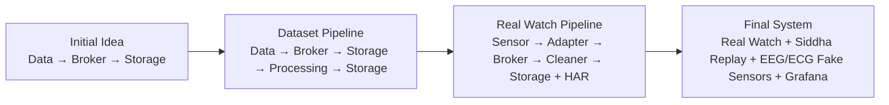
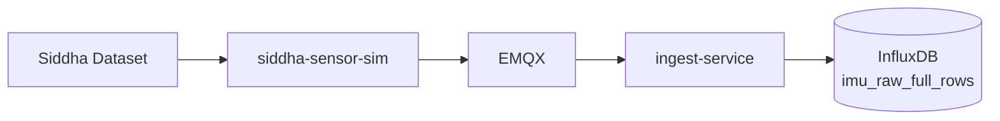
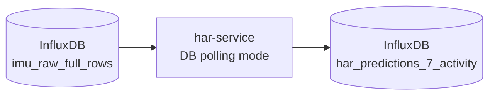
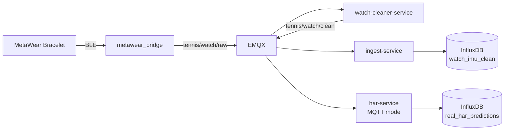
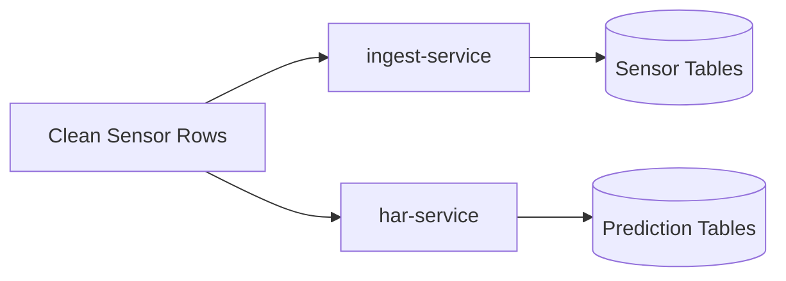
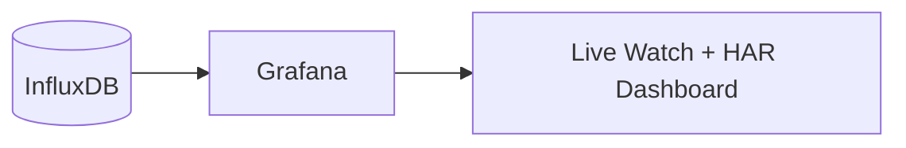
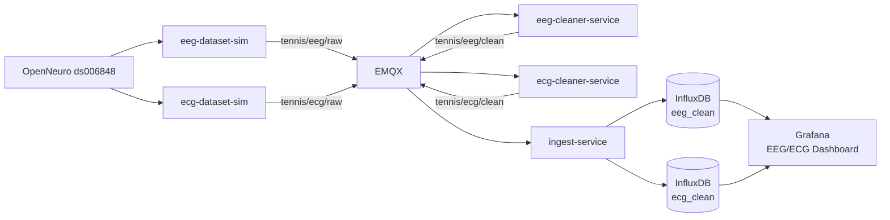

# Smart Tennis Field — Implementation Journal

## 1. Purpose

This journal records the main implementation decisions, architecture changes, lessons learned, and validation outcomes of the Smart Tennis Field thesis project.

For final technical references, see:

- [Architecture.md](Architecture.md)
- [Phases.md](Phases.md)
- [DatasetContract.md](DatasetContract.md)
- [Result.md](Result.md)

Unlike the roadmap, this document focuses on **why the system changed** during development.

## 2. Architecture Evolution

The project evolved in stages.



The project started as a basic MQTT and storage pipeline. It later added dataset replay, HAR inference, real sensor integration, Grafana visualization, and finally EEG/ECG fake-sensor sources to prove extensibility.

## 3. Phase 0 — MQTT Infrastructure

### What Was Built

- EMQX broker in Docker.
- Basic publisher/subscriber tests.
- MQTT topic-based routing.
- Docker networking conventions.

### Key Lesson

The first important Docker lesson was:

```text
localhost inside a container is not the host machine.
```

Docker services must communicate using Compose service names, such as:

```text
emqx:1883
```

From the host machine, EMQX is reached through the mapped port:

```text
localhost:2883
```

### Result

MQTT transport was validated before storage, inference, or visualization were added.

## 4. Phase 1 — Ingest Service and Persistence

### What Was Built

- FastAPI ingest-service.
- MQTT subscriber worker.
- InfluxDB 3 write integration.
- Generic event handling.
- Structured IMU writing.
- Health and stats endpoints.
- Batch writer with bounded queue.

### Key Decision

Ingestion must be observable.

The ingest-service exposes operational metrics such as:

```text
queue_depth
failed_batch_count
retried_line_count
dropped_line_count
writer_thread_alive
```

### Result

The system gained a reliable storage gateway for clean sensor data.

## 5. Phase 2 — Siddha Dataset Validation

### What Was Built

- Siddha Parquet dataset reader.
- Dataset simulator.
- MQTT replay.
- Structured IMU storage.
- Deterministic recording identifiers.

### Flow



Siddha replay allowed the pipeline to be tested with real dataset rows instead of simple dummy messages.

### Key Lesson

A live demo alone is not enough for a thesis. Dataset replay provides reproducibility, repeatability, and controlled validation.

### Result

The system proved it could ingest structured IMU data at scale.

## 6. Phase 3 — HAR Microservice

### What Was Built

- HAR microservice.
- InfluxDB polling mode.
- Ordered stream fetching.
- Sliding window construction.
- ONNX inference.
- Prediction storage.

### Flow



The HAR service reads stored dataset IMU rows, builds ordered windows, runs ONNX inference, and writes prediction rows back to InfluxDB.

### Important Fixes

- Mixed-device windows were avoided.
- Stream grouping by device and recording was required.
- Correct input layout was confirmed: `gyro_then_accel`.
- Correct temporal preprocessing was: `none`.
- Correct score aggregation was: `sum`.
- Model scope was limited to seven supported activities: `F, G, O, P, Q, R, S`.

### Result

The Phase 3 HAR path became reproducible and validated for the supported seven-activity model scope.

## 7. Phase 4 — Real Watch Architecture Update

### Why the Architecture Changed

The initial idea was to send real watch data directly into the existing ingestion and HAR path.

This was refined because raw hardware streams are not immediately suitable for storage or model inference. They require sensor-specific adaptation and cleaning.

The architecture added:

- `metawear_bridge`
- `watch-cleaner-service`
- `watch_imu_clean` table
- HAR MQTT stream mode
- `real_har_predictions` table

### Final Real Watch Flow



The bridge adapts BLE to MQTT. The cleaner produces canonical IMU rows. Ingest-service stores clean sensor data. HAR consumes clean rows and stores predictions.

### Engineering Reasoning

| Component | Responsibility |
|---|---|
| `metawear_bridge` | BLE acquisition and MQTT publishing |
| `watch-cleaner-service` | Validation and canonicalization |
| `ingest-service` | Storage of clean sensor data |
| `har-service` | Activity prediction |
| InfluxDB | Historical storage |
| Grafana | Visualization |

### Result

The architecture became more realistic for IoT systems because raw hardware adaptation, cleaning, ingestion, and inference were separated.

## 8. Prediction Storage Decision

A key decision was made:

```text
HAR writes predictions directly to InfluxDB.
```

Predictions are not routed through ingest-service.

Reason: Service ownership boundaries require separation. See [Architecture.md](Architecture.md) §3 for the architectural rule defining service responsibilities.

### Result

Prediction ownership stayed clear.



The ingest-service writes clean sensor data. The HAR service writes predictions. This prevents schema responsibilities from mixing.

## 9. Raw vs Clean Data Decision

The project stores clean sensor data, not every raw hardware callback.

Stored by default:

- `watch_imu_clean`
- `imu_raw_full_rows`
- `eeg_clean`
- `ecg_clean`
- `real_har_predictions`
- `har_predictions_7_activity`

Optional debug storage:

- `watch_imu_raw_debug`

### Reason

Clean rows are the actual input for downstream processing and visualization. Raw callbacks are useful for debugging, but they can be noisy, incomplete, and hardware-specific.

### Result

The database stays easier to query, explain, and defend.

## 10. Camera Scope Decision

Camera-based features were removed from the final scope.

### Reason

- No camera hardware was available.
- The final contribution focuses on wearable sensor ingestion and HAR.
- Keeping camera phases would create unnecessary scope confusion.
- Camera tracking would require a separate computer vision pipeline.

### Result

The final thesis scope became cleaner:

```text
wearable sensor pipeline + dataset replay + HAR + EEG/ECG extensibility
```

## 11. Phase 5 — Grafana Visualization

### What Was Built

- Grafana service in Docker Compose.
- InfluxDB datasource.
- Live Watch + HAR dashboard.
- 1-second refresh interval.
- Panels for watch IMU signals and HAR predictions.

### Visualization Path



Grafana reads from InfluxDB. This keeps the dashboard connected to persistent data instead of transient MQTT messages.

### Key Decision

Grafana Live / MQTT visualization was not implemented.

### Reason

InfluxDB-backed panels with a 1-second refresh interval were sufficient for thesis-scale live monitoring.

### Result

Phase 5 completed the visualization path without adding unnecessary complexity.

## 12. Phase 6 — EEG/ECG Dataset Sources

### What Was Built

Phase 6 added two dataset-based fake sensors using OpenNeuro ds006848:

- `eeg-dataset-sim`
- `ecg-dataset-sim`
- `eeg-cleaner-service`
- `ecg-cleaner-service`

### Flow



EEG and ECG were added as new sensor families without modifying the watch pipeline or the HAR service. This validates extensibility.

### Key Design Choice

EEG and ECG were not forced into the IMU schema.

Instead, they use separate tables:

- `eeg_clean`
- `ecg_clean`

### No EEG/ECG ML

No EEG or ECG machine learning was implemented.

This was intentional because the purpose of Phase 6 is:

```text
multi-source extensibility
```

not physiological signal classification.

### Result

Phase 6 completed the architecture extension and validated that the system can store and visualize heterogeneous sensor types.

## 13. Validation Results

Detailed validation evidence for each phase is documented separately:

- [Phase 4: Real MetaWear Watch Pipeline](Validation/phase4_validation_report.md)
- [Phase 5: Grafana Visualization](Validation/phase5_grafana_validation_report.md)
- [Phase 6: EEG/ECG Extensibility](Validation/phase6_eeg_ecg_validation_report.md)

For a summary of all results, see [Result.md](Result.md).
- No production deployment claims.
- No clinical interpretation.

This scope keeps the thesis focused, measurable, and defensible.
