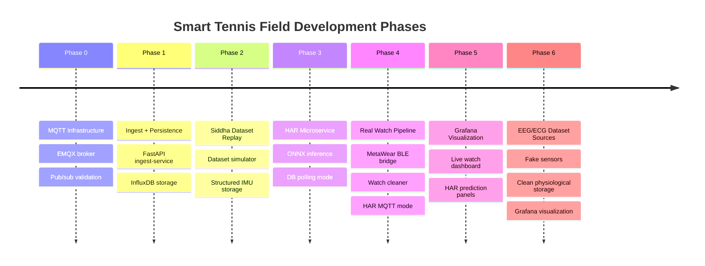
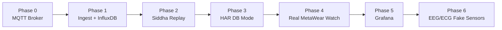
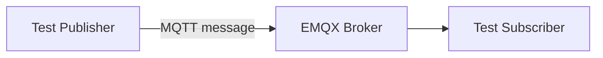
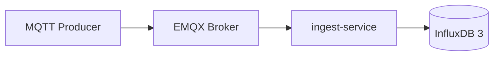
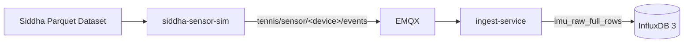
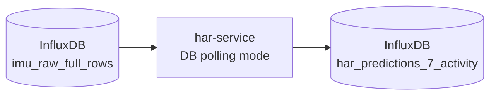
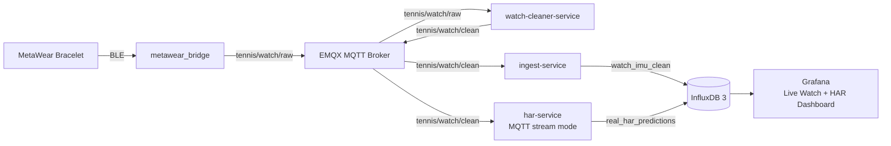
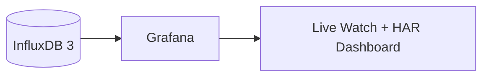
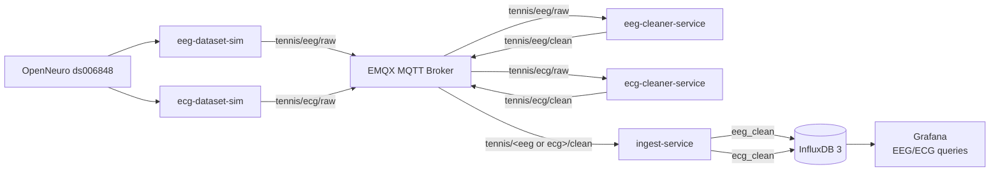

# Smart Tennis Field — Project Phases

## 1. Purpose

This document summarizes the implementation phases of the Smart Tennis Field thesis project.

The project evolved from a simple MQTT transport validation into a complete Docker-based IoT pipeline with:

- MQTT event transport.
- FastAPI ingestion.
- InfluxDB time-series storage.
- Siddha dataset replay.
- ONNX-based human activity recognition.
- Real MetaWear watch integration.
- Grafana visualization.
- EEG/ECG dataset-based fake sensors.

The final system validates both **real wearable monitoring** and **dataset-based multi-source extensibility**.

## 2. Phase Overview



| Phase | Status | Main Result |
|---|---|---|
| Phase 0 — MQTT Infrastructure | Completed | EMQX MQTT broker validated |
| Phase 1 — Ingest + Persistence | Completed | MQTT data stored in InfluxDB |
| Phase 2 — Dataset Validation | Completed | Siddha dataset replay stored as structured IMU rows |
| Phase 3 — HAR Microservice | Completed | ONNX HAR predictions generated and stored |
| Phase 4 — Real Watch Pipeline | Completed | MetaWear watch connected through BLE → MQTT → cleaner → storage → HAR |
| Phase 5 — Grafana Visualization | Completed | InfluxDB-backed dashboards for live monitoring |
| Phase 6 — EEG/ECG Dataset Sources | Completed | OpenNeuro EEG/ECG fake sensors stored and visualized |

Camera-based features were removed from the final thesis scope because no camera hardware was used and camera tracking is not part of the validated contribution.

## 3. Final System Evolution



Each phase added one architectural capability without replacing the previous one. The final project keeps both dataset replay and real hardware monitoring, which supports reproducibility and live demonstration.

## 4. Phase 0 — MQTT Infrastructure

**Status:** Completed

### Goal

Validate the event backbone using MQTT and Docker.

### Implemented

- EMQX broker.
- Docker Compose networking.
- MQTT publisher/subscriber validation.
- Host/container port separation.

| Context | MQTT Address |
|---|---|
| Inside Docker | `emqx:1883` |
| From host machine | `localhost:2883` |

### Flow



This phase proved that services could communicate through the broker before storage, machine learning, or visualization were added.

**Validation:** See [Validation/phase0_mqtt_validation_report.md](Validation/phase0_mqtt_validation_report.md)

## 5. Phase 1 — Ingest + Persistence

**Status:** Completed

### Goal

Persist MQTT messages into InfluxDB using a dedicated ingest microservice.

### Implemented

- FastAPI ingest-service.
- MQTT background subscriber.
- InfluxDB 3 write integration.
- Bounded write queue.
- Batch writer.
- Retry/drop counters.
- Health and stats endpoints.

### Flow



The ingest-service became the storage gateway for sensor data. It subscribes to configured MQTT topics and writes clean sensor rows to InfluxDB using batched writes.

### Important Design Choice

The ingest-service stores sensor data, not every possible system output. Prediction outputs are owned by the HAR service.

**Validation:** See [Validation/phase1_ingest_influx_validation_report.md](Validation/phase1_ingest_influx_validation_report.md)

## 6. Phase 2 — Siddha Dataset Replay

**Status:** Completed

### Goal

Validate the full infrastructure using real dataset rows instead of dummy messages.

### Implemented

- Siddha Parquet dataset loader.
- Deterministic dataset replay.
- MQTT publishing through `siddha-sensor-sim`.
- Structured IMU storage.
- InfluxDB table: `imu_raw_full_rows`.
- Batch-write performance validation.

### Flow



The Siddha dataset replay proved that the system could ingest structured IMU data at scale and store it reproducibly.

### Key Storage Table

```text
imu_raw_full_rows
```

**Validation:** See [Validation/phase2_siddha_replay_validation_report.md](Validation/phase2_siddha_replay_validation_report.md)

## 7. Phase 3 — HAR Microservice

**Status:** Completed

### Goal

Add human activity recognition after sensor data storage.

### Implemented

- `har-service`.
- ONNX model loading.
- InfluxDB DB polling mode.
- Stream grouping by device and recording.
- Sliding window construction.
- Prediction storage.
- Table: `har_predictions_7_activity`.

### Flow



The HAR service reads stored Siddha IMU rows, builds windows, runs ONNX inference, and writes prediction rows back to InfluxDB.

### Validated Runtime

| Parameter | Value |
|---|---|
| Device | `watch` |
| Input layout | `gyro_then_accel` |
| Temporal preprocessing | `none` |
| Score aggregation | `sum` |
| Prediction table | `har_predictions_7_activity` |
| Supported activities | `F,G,O,P,Q,R,S` |

### Important Limitation

The HAR model is not tennis-specific and supports only seven Siddha activities:

```text
F, G, O, P, Q, R, S
```

This is a model/domain limitation, not a pipeline failure.

**Validation:** See [Validation/phase3_har_validation_report.md](Validation/phase3_har_validation_report.md)

## 8. Phase 4 — Real Watch Pipeline

**Status:** Completed

### Goal

Integrate the MetaWear bracelet as a real hardware sensor and run live HAR inference.

### Implemented

- Local `metawear_bridge`.
- BLE → MQTT adaptation.
- Raw topic: `tennis/watch/raw`.
- `watch-cleaner-service`.
- Clean topic: `tennis/watch/clean`.
- InfluxDB table: `watch_imu_clean`.
- HAR MQTT stream mode.
- Prediction table: `real_har_predictions`.

### Flow




The MetaWear bracelet produces raw ACC/GYRO samples over BLE. The bridge publishes them to MQTT. The cleaner pairs and validates samples before storage and HAR inference.

### Validation Result

Phase 4 was validated with recording ID:

```text
phase4_live_validation_001
```

| Metric | Result |
|---|---|
| Duration | ~385 seconds |
| Clean IMU rows | 9,599 |
| HAR predictions | 463 |
| Approx. clean row rate | ~24.9 rows/s |
| Approx. prediction interval | ~0.83 s |
| Queue depth | 0 |
| Failed batches | 0 |
| Retries | 0 |
| Dropped lines | 0 |

**Validation:** See [Validation/phase4_validation_report.md](Validation/phase4_validation_report.md)

## 9. Phase 5 — Grafana Visualization

**Status:** Completed

### Goal

Visualize stored sensor data and predictions using Grafana.

### Implemented

- Grafana container.
- InfluxDB datasource.
- Live Watch + HAR dashboard.
- 1-second refresh configuration.
- Panels for IMU signals, predictions, confidence, history, and counts.

### Flow



Grafana reads from InfluxDB as the source of truth. MQTT/Grafana Live was considered but not needed because the InfluxDB-backed dashboard refreshes fast enough for thesis-scale live testing.

### Dashboard Content

| Panel Area | Source Table |
|---|---|
| Watch accelerometer | `watch_imu_clean` |
| Watch gyroscope | `watch_imu_clean` |
| Current prediction | `real_har_predictions` |
| Prediction confidence | `real_har_predictions` |
| Prediction history | `real_har_predictions` |
| Stored row counters | `watch_imu_clean`, `real_har_predictions` |

**Validation:** See [Validation/phase5_grafana_validation_report.md](Validation/phase5_grafana_validation_report.md)

## 10. Phase 6 — EEG/ECG Dataset Sources

**Status:** Completed

### Goal

Demonstrate multi-source extensibility using two additional heterogeneous sensor streams.

EEG and ECG are dataset-based fake sensors, not physical hardware integrations.

### Implemented

- OpenNeuro ds006848 dataset source.
- `eeg-dataset-sim`.
- `eeg-cleaner-service`.
- `ecg-dataset-sim`.
- `ecg-cleaner-service`.
- MQTT raw topics:
  - `tennis/eeg/raw`
  - `tennis/ecg/raw`
- MQTT clean topics:
  - `tennis/eeg/clean`
  - `tennis/ecg/clean`
- InfluxDB tables:
  - `eeg_clean`
  - `ecg_clean`
- Grafana EEG/ECG dashboard.

### Flow



Phase 6 validates that the architecture can accept new sensor families without changing the watch pipeline or forcing EEG/ECG into the IMU schema.

### Validation Target

With:

```text
EEG_MAX_SECONDS=600
ECG_MAX_SECONDS=600
EEG_DOWNSAMPLE_HZ=100
ECG_DOWNSAMPLE_HZ=100
```

Expected rows:

| Table | Expected Rows |
|---|---|
| `eeg_clean` | ~60,000 |
| `ecg_clean` | ~60,000 |

### Important Limitation

No EEG or ECG machine learning is implemented.

This is intentional. The goal is architecture extensibility, storage, and visualization, not physiological signal classification.

**Validation:** See [Validation/phase6_eeg_ecg_validation_report.md](Validation/phase6_eeg_ecg_validation_report.md)

## 11. Final Architecture After All Phases

The final topology is maintained in [Architecture.md](Architecture.md). This file keeps the phase chronology and avoids repeating the full architecture diagram.

## 12. Final Scope Summary

### Implemented

- MQTT broker-based transport.
- FastAPI ingest-service.
- InfluxDB 3 persistence.
- Siddha dataset replay.
- HAR ONNX inference.
- MetaWear BLE integration.
- Watch cleaner.
- EEG/ECG dataset fake sensors.
- Grafana visualization.

### Not Implemented

- Camera tracking.
- EEG/ECG machine learning.
- Production deployment.
- Clinical interpretation.
- Production authentication/authorization.

### Final Thesis Position

The project is validated for thesis-scale live testing.

It demonstrates:

- Reproducible dataset replay.
- Real wearable sensor integration.
- Service-level separation of responsibilities.
- Time-series storage.
- ML prediction storage.
- Grafana observability.
- Extensibility to additional heterogeneous sensor types.
