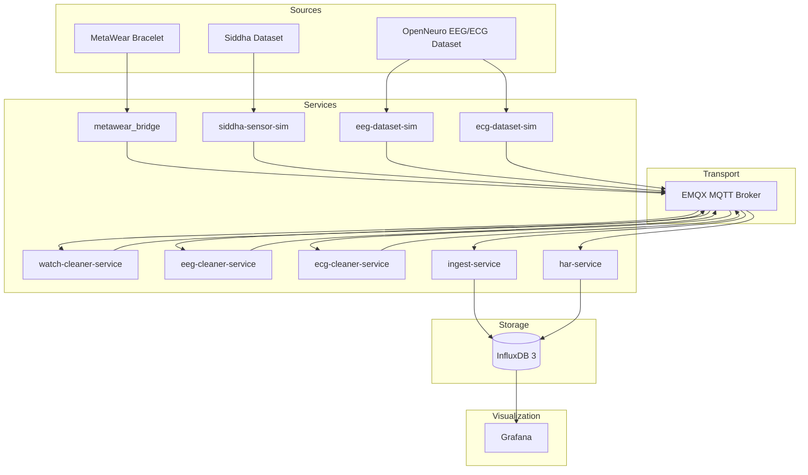
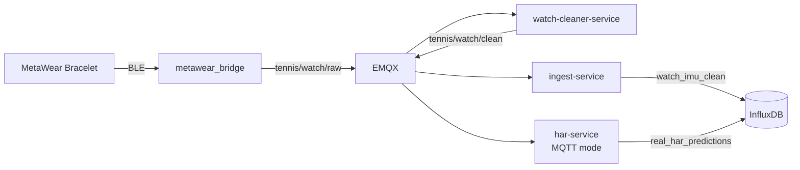
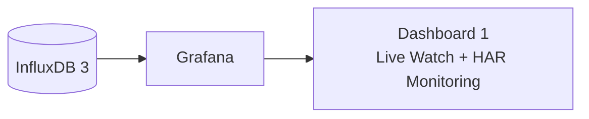
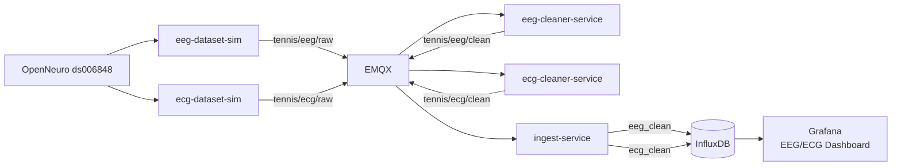
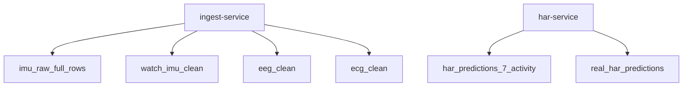
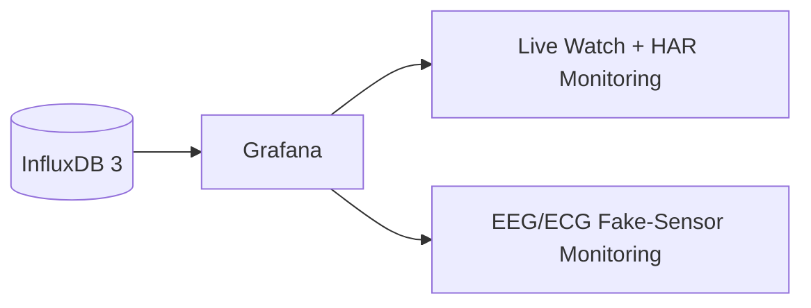

# Smart Tennis Field — Results

## 1. Purpose

This document summarizes the validated results of the Smart Tennis Field thesis project.

The project validates a Docker-based IoT architecture for:

- MQTT-based sensor transport.
- Clean sensor ingestion.
- InfluxDB time-series persistence.
- Siddha dataset replay.
- ONNX-based HAR inference.
- Real MetaWear watch monitoring.
- Grafana visualization.
- EEG/ECG dataset-based fake sensors.

The results are grouped by validation area rather than by code component.

## 2. Final Validated System



The final system supports both real hardware data and dataset-based replay. All clean sensor data is stored by the ingest-service, while HAR predictions are produced and stored by the HAR service.

## 3. Result Summary

| Area | Result |
|---|---|
| MQTT transport | EMQX broker validated |
| Ingestion | FastAPI ingest-service stores clean sensor rows |
| Storage | InfluxDB 3 stores IMU, EEG, ECG, and prediction tables |
| Siddha replay | Dataset IMU rows replayed and stored |
| HAR DB mode | ONNX inference validated on supported Siddha activities |
| Real watch pipeline | MetaWear → BLE → MQTT → cleaner → storage validated |
| HAR MQTT mode | Live watch predictions stored in `real_har_predictions` |
| Grafana | Two dashboards implemented from InfluxDB |
| EEG/ECG extension | Dataset fake sensors stored and visualized |
| Scope control | No EEG/ECG ML and no camera tracking |

## 4. Phase 3 — HAR Dataset Evaluation Result

Phase 3 evaluated the ONNX HAR model using stored Siddha watch data.

### 4.1 Evaluation Setup

| Parameter | Value |
|---|---|
| Model | `L2MU_plain_leaky.onnx` |
| Input table | `imu_raw_full_rows` |
| Output table | `har_predictions_7_activity` |
| Device filter | `watch` |
| Supported labels | `F, G, O, P, Q, R, S` |
| Input layout | `gyro_then_accel` |
| Temporal preprocessing | `none` |
| Score aggregation | `sum` |

### 4.2 Validated Result

The validated seven-activity evaluation produced:

```text
Watch-device data only: 119 / 140 correct = 85.0% accuracy
Overall (all devices):    21 / 140 correct = 15.0% accuracy
```

**Note:** The 85% result is achieved using `device=watch` filter with `gyro_then_accel` input layout. Without device filtering, overall accuracy drops to 15% due to phone data and unsupported activities.

Supported activities:

| Code | Activity |
|---|---|
| F | Typing |
| G | Brushing Teeth |
| O | Playing Catch / Tennis-related catch |
| P | Basketball Dribbling |
| Q | Writing |
| R | Clapping |
| S | Folding Clothes |

### 4.3 Interpretation

This result proves that:

- Ordered IMU rows can be fetched from InfluxDB.
- Sliding windows can be built deterministically.
- The ONNX model can run inside the HAR service.
- Predictions can be written back to InfluxDB.
- The selected preprocessing configuration is compatible with the model.

It does not prove:

- Full 18-activity classification.
- Strong accuracy for phone data.
- Tennis-specific performance.
- Guaranteed real-world MetaWear accuracy.

The model limitation is separate from the pipeline validity.

## 5. Phase 4 — Real MetaWear Watch Validation

Phase 4 validated the real hardware pipeline.



This validation tested live acquisition, cleaning, ingestion, HAR inference, and prediction storage. It was not primarily an accuracy test.

### 5.1 Validation Metrics

Validated recording ID:

```text
phase4_live_validation_001
```

| Metric | Result |
|---|---|
| Streaming duration | ~385 seconds |
| Clean IMU rows stored | 9,599 |
| HAR predictions stored | 463 |
| Approx. clean row rate | ~24.9 rows/s |
| Approx. prediction interval | ~0.83 s |
| Ingest queue depth | 0 |
| Failed batches | 0 |
| Retried lines | 0 |
| Dropped lines | 0 |

### 5.2 Interpretation

The result validates that:

- MetaWear data can be captured through BLE.
- Raw watch events can be transported over MQTT.
- The cleaner can produce complete IMU rows.
- Ingest-service can store real watch data.
- HAR can consume clean MQTT rows.
- Predictions can be persisted.
- The writer queue remains stable during live testing.

Weak real-world HAR accuracy would indicate model/domain shift, not failure of the IoT pipeline.

## 6. Phase 5 — Grafana Visualization Result

Phase 5 completed the visualization layer.



Grafana uses InfluxDB as the source of truth. MQTT/Grafana Live was considered but not required because InfluxDB-backed panels refresh fast enough for thesis-scale monitoring.

### 6.1 Live Watch + HAR Dashboard

The dashboard visualizes:

| Panel Area | Source Table |
|---|---|
| Watch accelerometer | `watch_imu_clean` |
| Watch gyroscope | `watch_imu_clean` |
| Current predicted activity | `real_har_predictions` |
| Prediction confidence | `real_har_predictions` |
| Prediction history | `real_har_predictions` |
| Stored row counters | `watch_imu_clean`, `real_har_predictions` |

### 6.2 Interpretation

The dashboard validates the observability path:

```text
InfluxDB → Grafana
```

The final design uses stored time-series data, not transient MQTT-only visualization.

## 7. Phase 6 — EEG/ECG Fake-Sensor Validation

Phase 6 validated heterogeneous dataset-based sensor extensibility.



EEG and ECG are replayed as dataset-based fake sensors. Each has its own simulator, cleaner, MQTT topics, storage table, and Grafana panels. No EEG/ECG ML is implemented.

### 7.1 Expected Validation Size

With:

```text
EEG_MAX_SECONDS=600
ECG_MAX_SECONDS=600
EEG_DOWNSAMPLE_HZ=100
ECG_DOWNSAMPLE_HZ=100
```

Expected rows:

| Table | Expected Rows |
|---|---|
| `eeg_clean` | ~60,000 |
| `ecg_clean` | ~60,000 |

### 7.2 Validation Criteria

Phase 6 is considered valid when:

| Check | Expected Result |
|---|---|
| EEG simulator publishes raw rows | yes |
| ECG simulator publishes raw rows | yes |
| EEG cleaner publishes clean rows | yes |
| ECG cleaner publishes clean rows | yes |
| `eeg_clean` receives rows | > 0, target ~60,000 |
| `ecg_clean` receives rows | > 0, target ~60,000 |
| Ingest queue depth | 0 after replay |
| Failed batches | 0 |
| Dropped lines | 0 |
| Grafana EEG panel works | yes |
| Grafana ECG panel works | yes |

### 7.3 Interpretation

This result validates that the architecture can add new sensor families without:

- Modifying the watch pipeline.
- Routing physiological data through the HAR model.
- Forcing EEG/ECG into the IMU schema.
- Mixing clean sensor rows with prediction rows.

This is the main extensibility result of Phase 6.

## 8. Final Storage Result

| Table | Producer | Purpose |
|---|---|---|
| `imu_raw_full_rows` | `ingest-service` | Siddha IMU dataset rows |
| `watch_imu_clean` | `ingest-service` | Clean real watch IMU rows |
| `eeg_clean` | `ingest-service` | Clean EEG fake-sensor rows |
| `ecg_clean` | `ingest-service` | Clean ECG fake-sensor rows |
| `har_predictions_7_activity` | `har-service` | Dataset HAR predictions |
| `real_har_predictions` | `har-service` | Real watch HAR predictions |



The storage result confirms the ownership model: clean sensor data belongs to ingest-service, while prediction output belongs to HAR.

## 9. Final Grafana Result

The final visualization layer contains two dashboards:



| Dashboard | Purpose |
|---|---|
| Live Watch + HAR Monitoring | Validate real watch IMU and HAR predictions |
| EEG/ECG Fake-Sensor Monitoring | Validate dataset-based physiological sensor ingestion |

This confirms that both real and fake sensor pipelines are observable from persisted InfluxDB data.

## 10. Final Limitations

The project does not claim:

- Production readiness.
- Clinical EEG/ECG interpretation.
- EEG/ECG machine learning.
- Tennis-specific HAR accuracy.
- Camera-based tracking.
- Full 18-activity HAR classification.
- Deployment to a true edge device.

These limitations are intentional and keep the thesis scope controlled.

## 11. Final Result Statement

The final system successfully demonstrates a thesis-scale IoT microservice architecture for:

- Real wearable sensor ingestion.
- Reproducible dataset replay.
- Time-series persistence.
- Activity recognition inference.
- Live dashboard visualization.
- Heterogeneous sensor extensibility.

The strongest result is not only the HAR output, but the validated architecture:

```text
Data Source → Adapter/Simulator → MQTT Broker → Cleaner → Storage/Processing → Visualization
```

This architecture was validated with:

- Siddha IMU dataset replay.
- Real MetaWear watch streaming.
- OpenNeuro EEG/ECG fake-sensor replay.
- InfluxDB storage.
- Grafana dashboards.
