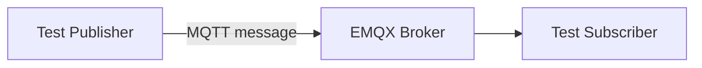

# Phase 0 Validation Report — MQTT Infrastructure

## 1. Goal

Validate that the project has a working MQTT transport layer using EMQX inside Docker Compose.

Phase 0 proves that services can communicate through a broker before adding storage, inference, or visualization.

## 2. Validated Architecture



The publisher sends a message to EMQX. The subscriber receives the message from the broker. This validates the basic event backbone.

## 3. Components

| Component | Role |
|---|---|
| `emqx` | MQTT broker |
| Test publisher | Sends test MQTT messages |
| Test subscriber | Receives MQTT messages |

## 4. Network Configuration

| Context | MQTT Address |
|---|---|
| Inside Docker Compose | `emqx:1883` |
| From host machine | `localhost:2883` |
| EMQX Dashboard | `http://localhost:18083` |

## 5. Validation Criteria

| Check | Expected Result | Status |
|---|---|---|
| EMQX starts in Docker | Container running | Pass |
| MQTT port available inside Docker | `emqx:1883` reachable | Pass |
| MQTT port available from host | `localhost:2883` reachable | Pass |
| Publisher can send message | Message accepted by broker | Pass |
| Subscriber can receive message | Message delivered | Pass |

## 6. Result

Phase 0 validated the MQTT broker as the system transport backbone.

This phase established the communication base for later services:

```text
producer → MQTT broker → consumer
```

## 7. Conclusion

Phase 0 is completed.

The project can use EMQX as the central message broker for dataset simulators, real sensor adapters, cleaners, ingest-service, and HAR service.
