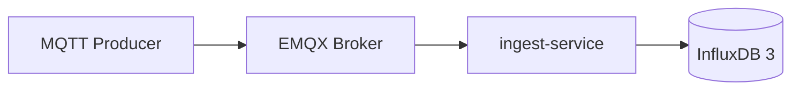

# Phase 1 Validation Report — Ingest Service and InfluxDB

## 1. Goal

Validate that MQTT messages can be received by the FastAPI ingest-service and persisted into InfluxDB 3.

Phase 1 proves the storage backbone of the system.

## 2. Validated Architecture



The ingest-service subscribes to configured MQTT topics, converts messages into storage-safe rows, and writes them to InfluxDB.

## 3. Components

| Component | Role |
|---|---|
| `emqx` | MQTT broker |
| `ingest-service` | MQTT subscriber and storage gateway |
| `influxdb3` | Time-series database |
| `influxdb3-explorer` | InfluxDB web UI |

## 4. Implemented Features

| Feature | Result |
|---|---|
| FastAPI service | Implemented |
| MQTT background subscriber | Implemented |
| InfluxDB write integration | Implemented |
| Batch writer | Implemented |
| Bounded queue | Implemented |
| Retry and drop counters | Implemented |
| `/health` endpoint | Implemented |
| `/stats` endpoint | Implemented |

## 5. Health Endpoints

```bash
curl http://localhost:8000/health
curl http://localhost:8000/stats
```

Expected writer health:

```text
queue_depth = 0
failed_batch_count = 0
retried_line_count = 0
dropped_line_count = 0
writer_thread_alive = true
```

## 6. Validation Criteria

| Check | Expected Result | Status |
|---|---|---|
| ingest-service starts | FastAPI app running | Pass |
| ingest-service connects to MQTT | MQTT connection established | Pass |
| ingest-service subscribes to configured topics | Subscriptions active | Pass |
| InfluxDB writes succeed | Rows appear in database | Pass |
| `/health` responds | Service status returned | Pass |
| `/stats` responds | Table counts and writer metrics returned | Pass |
| Writer queue drains | `queue_depth = 0` after replay | Pass |

## 7. Result

Phase 1 completed the storage gateway layer.

The system can now persist clean sensor rows into InfluxDB using an observable and fault-aware ingestion path.

## 8. Conclusion

Phase 1 is completed.

The ingest-service became the central storage gateway for clean sensor data, while later phases add dataset replay, HAR inference, real hardware, and visualization.
