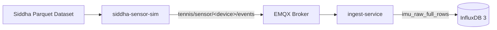

# Phase 2 Validation Report — Siddha Dataset Replay

## 1. Goal

Validate that a real IMU dataset can be replayed through MQTT and stored as structured rows in InfluxDB.

Phase 2 moves the system from dummy messages to reproducible dataset-based validation.

## 2. Validated Architecture



The Siddha simulator reads IMU rows from the dataset, publishes them to MQTT, and ingest-service stores them in InfluxDB.

## 3. Components

| Component | Role |
|---|---|
| `siddha-sensor-sim` | Dataset replay producer |
| `emqx` | MQTT broker |
| `ingest-service` | Stores structured IMU rows |
| `influxdb3` | Time-series storage |

## 4. Data Contract

Stored table:

```text
imu_raw_full_rows
```

Important fields:

| Field | Meaning |
|---|---|
| `device` | Dataset device, usually `watch` or `phone` |
| `recording_id` | Recording/session identifier |
| `sample_idx` | Sample index |
| `dataset_ts` | Time inside dataset recording |
| `acc_x`, `acc_y`, `acc_z` | Accelerometer axes |
| `gyro_x`, `gyro_y`, `gyro_z` | Gyroscope axes |
| `activity_gt` | Ground-truth activity label |

## 5. Run Command

Start backend:

```bash
docker compose up -d emqx influxdb3 ingest-service
```

Run replay:

```bash
docker compose --profile replay up siddha-sensor-sim
```

Check stored rows:

```sql
SELECT COUNT(*) AS n
FROM imu_raw_full_rows;
```

## 6. Validation Criteria

| Check | Expected Result | Status |
|---|---|---|
| Siddha dataset loads | Dataset rows available | Pass |
| Simulator publishes MQTT messages | Messages reach EMQX | Pass |
| Ingest-service receives rows | MQTT subscription works | Pass |
| Rows stored in InfluxDB | `imu_raw_full_rows` populated | Pass |
| Structured IMU fields exist | ACC/GYRO fields present | Pass |
| Writer queue drains | `queue_depth = 0` after replay | Pass |
| Failed batches | `0` | Pass |
| Dropped lines | `0` | Pass |

## 7. Result

Phase 2 validated reproducible dataset ingestion.

The project can replay real IMU dataset rows through the same MQTT and storage path used by later live and fake-sensor sources.

## 8. Conclusion

Phase 2 is completed.

Siddha replay remains available through the Compose `replay` profile for reproducible testing and HAR dataset evaluation.
