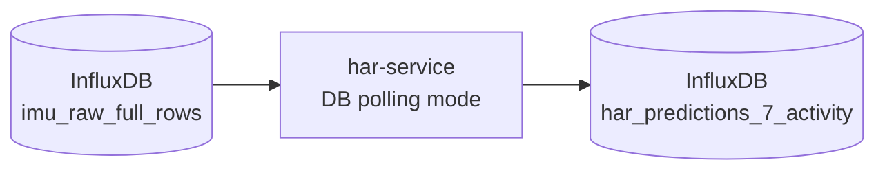

# Phase 3 Validation Report — HAR Microservice

## 1. Goal

Validate that stored Siddha IMU rows can be processed by the HAR service using an ONNX model, and that predictions can be written back to InfluxDB.

## 2. Validated Architecture



The HAR service reads stored IMU rows, builds sliding windows, runs ONNX inference, and stores prediction rows.

## 3. Evaluation Setup

| Parameter | Value |
|---|---|
| Model | `L2MU_plain_leaky.onnx` |
| Input table | `imu_raw_full_rows` |
| Output table | `har_predictions_7_activity` |
| Device filter | `watch` |
| Input layout | `gyro_then_accel` |
| Temporal preprocessing | `none` |
| Score aggregation | `sum` |
| Supported activities | `F,G,O,P,Q,R,S` |

## 4. Supported Activities

| Code | Activity |
|---|---|
| F | Typing |
| G | Brushing Teeth |
| O | Playing Catch / Tennis-related catch |
| P | Basketball Dribbling |
| Q | Writing |
| R | Clapping |
| S | Folding Clothes |

The model does not support all 18 Siddha activities.

## 5. Validated Result

The validated seven-activity evaluation produced:

```text
Watch-device data only: 119 / 140 correct = 85.0% accuracy
Overall (all devices):    21 / 140 correct = 15.0% accuracy
```

**Note:** The 85% result is achieved using `device=watch` filter with `gyro_then_accel` input layout. Without device filtering, overall accuracy drops to 15% due to phone data and unsupported activities.

## 6. Validation Criteria

| Check | Expected Result | Status |
|---|---|---|
| HAR service starts | Container running | Pass |
| ONNX model loads | Model available | Pass |
| Input table query works | Rows fetched from `imu_raw_full_rows` | Pass |
| Rows grouped correctly | Grouped by device and recording | Pass |
| Sliding windows built | Window construction succeeds | Pass |
| Inference runs | Predictions generated | Pass |
| Predictions stored | `har_predictions_7_activity` populated | Pass |
| Model scope respected | Only supported labels evaluated | Pass |

## 7. Interpretation

This phase validates the HAR processing pipeline.

It proves:

- InfluxDB rows can be fetched in deterministic order.
- IMU windows can be built.
- ONNX inference runs inside the service.
- Prediction rows can be stored.

It does not prove:

- Full 18-activity classification.
- Tennis-specific stroke recognition.
- Strong real-world MetaWear accuracy.
- Clinical/professional-grade activity recognition.

## 8. Conclusion

Phase 3 is completed.

The HAR service is valid for thesis-scale evaluation of the supported Siddha activity subset.
