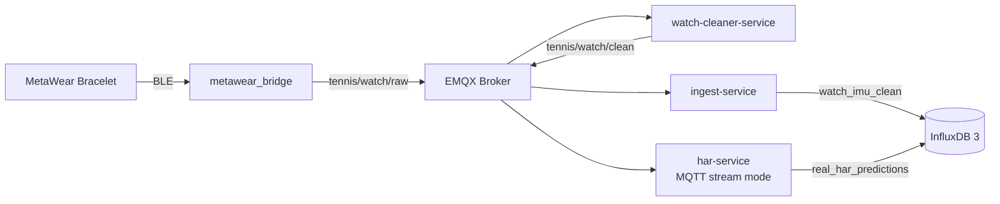

# Phase 4 Validation Report — Real MetaWear Watch Pipeline

## 1. Goal

Validate the real watch pipeline from MetaWear BLE acquisition to MQTT, cleaning, InfluxDB storage, HAR inference, and prediction storage.

This phase validates the live IoT path. It is not primarily an accuracy evaluation of the HAR model.

## 2. Test Context

| Item | Value |
|---|---|
| Recording ID | `phase4_live_validation_001` |
| Date | 2026-05-14 |
| Local time | 15:19–15:27 |
| UTC time | 13:19–13:27 |
| Sensor | MetaWear MMR |
| MAC | `C9:E5:38:6A:CC:E5` |
| Configured sampling rate | 25 Hz |
| Streaming duration | ~385 seconds |

## 3. Validated Architecture



The bridge converts BLE callbacks to MQTT raw messages. The cleaner creates canonical IMU rows. The ingest-service stores clean rows, while HAR consumes clean rows and stores predictions.

## 4. Test Execution Summary

| Step | Result |
|---|---|
| Docker services started | Running |
| MetaWear bridge started | `python -m app.bridge` |
| BLE connection | Successful |
| Raw publish rate | ~26 ACC/s + ~26 GYRO/s |
| Cleaner output | Clean IMU rows published |
| Ingest storage | Rows stored in `watch_imu_clean` |
| HAR output | Predictions stored in `real_har_predictions` |

Grafana was not running during the original Phase 4 validation test. Visualization was validated later in Phase 5.

## 5. Stored Watch Rows

Query:

```sql
SELECT COUNT(*) AS n
FROM watch_imu_clean
WHERE recording_id = 'phase4_live_validation_001';
```

| Metric | Value |
|---|---:|
| Actual rows | 9,599 |
| Expected rows | ~9,625 |
| Delta | -26 rows |
| Difference | ~0.27% |

Interpretation:

The small row difference is within thesis-scale tolerance and occurred during initial stream startup/pairing behavior.

## 6. Stored HAR Predictions

Query:

```sql
SELECT COUNT(*) AS n
FROM real_har_predictions
WHERE recording_id = 'phase4_live_validation_001';
```

| Metric | Value |
|---|---:|
| Actual predictions | 463 |
| Expected approximate predictions | ~481 |
| Window size | 40 samples |
| Window stride | 20 samples |
| Approx. prediction interval | ~0.83 s |

Interpretation:

The difference from the theoretical count is expected because HAR must accumulate a complete first window and operates with timing/polling overhead.

## 7. Sample Data Validation

Clean IMU rows contained expected fields:

| Field | Status |
|---|---|
| `device` | Valid |
| `recording_id` | Valid |
| `sample_idx` | Valid |
| `dataset_ts` | Valid |
| `acc_x`, `acc_y`, `acc_z` | Valid |
| `gyro_x`, `gyro_y`, `gyro_z` | Valid |
| `activity_gt` | `unknown`, expected for live data |

Prediction rows contained expected fields:

| Field | Status |
|---|---|
| `predicted_label` | Valid model output |
| `confidence` | Present |
| `model_name` | Present |
| `input_layout` | `gyro_then_accel` |
| `score_aggregation` | `sum` |
| `window_size` | `40` |
| `window_stride` | `20` |
| `recording_id` | `phase4_live_validation_001` |

## 8. Ingest Writer Health

Command:

```bash
curl http://localhost:8000/stats
```

| Metric | Value | Status |
|---|---:|---|
| `queue_depth` | 0 | Pass |
| `failed_batch_count` | 0 | Pass |
| `retried_line_count` | 0 | Pass |
| `dropped_line_count` | 0 | Pass |
| `writer_thread_alive` | true | Pass |

## 9. Validation Summary

| Criterion | Expected | Actual | Verdict |
|---|---:|---:|---|
| Clean IMU rows | ~9,625 | 9,599 | Pass |
| HAR predictions | ~481 | 463 | Pass |
| Row rate | ~25 rows/s | ~24.9 rows/s | Pass |
| Prediction interval | ~0.8 s | ~0.83 s | Pass |
| Queue depth | 0 | 0 | Pass |
| Failed batches | 0 | 0 | Pass |
| Retries | 0 | 0 | Pass |
| Dropped lines | 0 | 0 | Pass |
| Writer alive | true | true | Pass |

## 10. Interpretation

Phase 4 validates the complete real watch path:

```text
MetaWear → BLE → MQTT raw → watch cleaner → MQTT clean → ingest-service → InfluxDB → HAR MQTT mode → prediction storage
```

The validation proves that the system can ingest and process real sensor data in near real time.

Weak or unexpected real-world labels should be interpreted as model/domain-shift behavior, not pipeline failure.

## 11. Conclusion

Phase 4 is completed.

The MetaWear live watch pipeline is validated for thesis-scale live testing.
