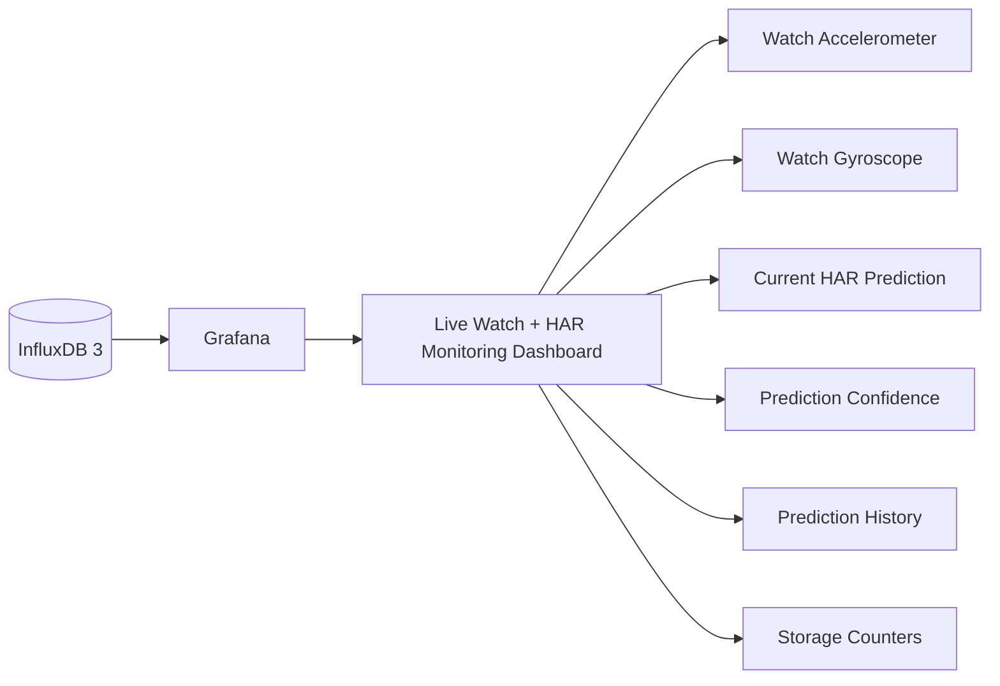

# Phase 5 Validation Report — Grafana Visualization

## 1. Goal

Validate that Grafana can visualize the Smart Tennis Field live watch pipeline using InfluxDB as the persistent source of truth.

## 2. Validated Architecture



Grafana reads stored rows from InfluxDB. The dashboard shows both clean watch IMU data and HAR prediction data.

## 3. Data Sources

| Table | Purpose |
|---|---|
| `watch_imu_clean` | Clean MetaWear IMU rows |
| `real_har_predictions` | Live HAR prediction rows |

## 4. Dashboard Panels

| Panel | Source Table | Purpose |
|---|---|---|
| Current Predicted Activity | `real_har_predictions` | Show latest HAR output |
| Current Confidence | `real_har_predictions` | Show latest prediction confidence |
| Prediction Timeline | `real_har_predictions` | Show prediction changes over time |
| Live Accelerometer | `watch_imu_clean` | Show watch acceleration |
| Live Gyroscope | `watch_imu_clean` | Show watch rotation |
| Prediction History | `real_har_predictions` | Inspect prediction rows |
| Stored Clean IMU Rows | `watch_imu_clean` | Validate watch ingestion |
| Stored Predictions | `real_har_predictions` | Validate HAR output storage |

## 5. Refresh Configuration

Grafana minimum refresh interval:

```env
GF_DASHBOARDS_MIN_REFRESH_INTERVAL=1s
```

Dashboard refresh:

```text
1 second
```

## 6. Validation Criteria

| Check | Expected Result | Status |
|---|---|---|
| Grafana container starts | Running | Pass |
| Dashboard opens | `http://localhost:3000` | Pass |
| InfluxDB datasource connects | Connected | Pass |
| Watch IMU panels display data | Rows from `watch_imu_clean` visible | Pass |
| HAR panels display data | Rows from `real_har_predictions` visible | Pass |
| Refresh works | 1-second refresh active | Pass |
| MQTT/Grafana Live required | No | Pass |

## 7. Why MQTT/Grafana Live Was Not Used

Grafana Live or MQTT panels were considered but not used in the final design.

Reason:

- InfluxDB-backed panels refresh at 1 second.
- The dashboard remains connected to persistent stored data.
- The approach is easier to reproduce and explain.
- It is sufficient for thesis-scale monitoring.

## 8. Result

Phase 5 validated the visualization layer:

```text
InfluxDB → Grafana
```

Grafana successfully visualizes clean watch data, HAR predictions, prediction confidence, and storage counters.

## 9. Conclusion

Phase 5 is completed.

Grafana provides thesis-ready monitoring for the live watch and HAR pipeline using InfluxDB as the source of truth.
