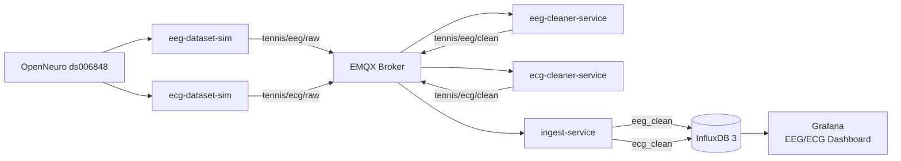

# Phase 6 Validation Report — EEG/ECG Fake-Sensor Pipeline

## 1. Goal

Validate that the Smart Tennis Field architecture can support two additional heterogeneous dataset-based sensor sources: EEG and ECG.

Phase 6 is not an EEG/ECG machine learning phase. It validates ingestion, cleaning, storage, and visualization.

## 2. Dataset

| Item | Value |
|---|---|
| Dataset | OpenNeuro `ds006848` |
| Used modalities | EEG and ECG |
| Source type | Dataset-based fake sensor |
| Task used | `verbalwm` |
| Example subject | `sub-001` |
| ML scope | No EEG/ECG ML |

## 3. Validated Architecture



The EEG and ECG simulators read dataset files and publish raw messages. Cleaner services validate and normalize rows. Ingest-service stores the clean rows in separate InfluxDB tables.

## 4. Configuration

Default validation configuration:

```env
EEG_MAX_SECONDS=600
ECG_MAX_SECONDS=600
EEG_DOWNSAMPLE_HZ=100
ECG_DOWNSAMPLE_HZ=100
EEG_CHANNEL_LIMIT=8
INFLUX_EEG_TABLE=eeg_clean
INFLUX_ECG_TABLE=ecg_clean
```

Expected row count:

```text
600 seconds × 100 Hz = 60,000 rows per sensor
```

## 5. Run Commands

Reset previous Phase 6 data:

```bash
python3 reset_phase6_tables.py
```

Build Phase 6 services:

```bash
docker compose --profile phase6 build
```

Start cleaner services:

```bash
docker compose --profile phase6 up -d eeg-cleaner-service ecg-cleaner-service
```

Start EEG simulator:

```bash
docker compose --profile phase6 up -d eeg-dataset-sim
```

Start ECG simulator:

```bash
docker compose --profile phase6 up -d ecg-dataset-sim
```

## 6. Validation Queries

EEG row count:

```sql
SELECT COUNT(*) AS n
FROM eeg_clean;
```

ECG row count:

```sql
SELECT COUNT(*) AS n
FROM ecg_clean;
```

Latest EEG rows:

```sql
SELECT
  time,
  subject,
  task,
  recording_id,
  sample_idx,
  dataset_ts,
  sampling_rate_hz,
  channel_count,
  quality
FROM eeg_clean
ORDER BY time DESC
LIMIT 10;
```

Latest ECG rows:

```sql
SELECT
  time,
  subject,
  task,
  recording_id,
  sample_idx,
  dataset_ts,
  sampling_rate_hz,
  ecg_value,
  unit,
  quality
FROM ecg_clean
ORDER BY time DESC
LIMIT 10;
```

## 7. Expected Result

| Table | Expected Rows |
|---|---:|
| `eeg_clean` | ~60,000 |
| `ecg_clean` | ~60,000 |

Healthy ingest writer state:

| Metric | Expected |
|---|---|
| `queue_depth` | 0 after replay |
| `failed_batch_count` | 0 |
| `retried_line_count` | 0 |
| `dropped_line_count` | 0 |
| `writer_thread_alive` | true |

## 8. Grafana Validation

Dashboard:

```text
EEG/ECG Fake-Sensor Monitoring
```

Required panels:

| Panel | Source Table | Purpose |
|---|---|---|
| EEG Row Count | `eeg_clean` | Validate EEG ingestion |
| ECG Row Count | `ecg_clean` | Validate ECG ingestion |
| EEG Signal Preview | `eeg_clean` | Show selected EEG channels |
| ECG Waveform | `ecg_clean` | Show ECG signal |
| Sampling Rate / Latest Rows | `eeg_clean`, `ecg_clean` | Validate metadata |

Example EEG query:

```sql
SELECT
  time,
  Fp1 * 1000000 AS Fp1_uV,
  Fp2 * 1000000 AS Fp2_uV
FROM eeg_clean
ORDER BY time ASC;
```

Example ECG query:

```sql
SELECT
  time,
  ecg_value * 1000 AS ecg_mV
FROM ecg_clean
ORDER BY time ASC;
```

## 9. Validation Criteria

| Check | Expected Result | Status |
|---|---|---|
| EEG simulator starts | Running | Pass |
| ECG simulator starts | Running | Pass |
| EEG cleaner starts | Running | Pass |
| ECG cleaner starts | Running | Pass |
| EEG raw topic receives data | `tennis/eeg/raw` active | Pass |
| ECG raw topic receives data | `tennis/ecg/raw` active | Pass |
| EEG clean topic receives data | `tennis/eeg/clean` active | Pass |
| ECG clean topic receives data | `tennis/ecg/clean` active | Pass |
| EEG rows stored | `eeg_clean` populated | Pass |
| ECG rows stored | `ecg_clean` populated | Pass |
| Grafana EEG panel works | Signal visible | Pass |
| Grafana ECG panel works | Signal visible | Pass |

## 10. Interpretation

Phase 6 validates architectural extensibility.

It proves that new sensor families can be added by implementing:

```text
dataset simulator → raw MQTT → cleaner → clean MQTT → ingest-service → InfluxDB → Grafana
```

without changing:

- The real watch pipeline.
- HAR ownership.
- IMU table structure.
- Prediction tables.

## 11. Limitations

Phase 6 does not claim:

- EEG classification.
- ECG classification.
- Clinical interpretation.
- Real EEG/ECG hardware integration.
- Production physiological monitoring.

These are future work.

## 12. Conclusion

Phase 6 is completed.

The system successfully validates EEG and ECG dataset-based fake sensors as heterogeneous extensions of the Smart Tennis Field IoT architecture.
