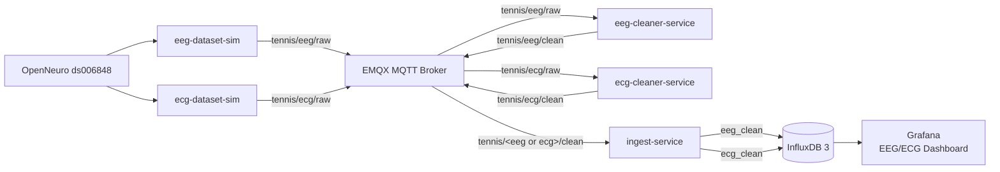

```mermaid
flowchart LR
    OD[OpenNeuro ds006848] --> EEGSIM[eeg-dataset-sim]
    OD --> ECGSIM[ecg-dataset-sim]

    EEGSIM -->|tennis/eeg/raw| EMQX[EMQX MQTT Broker]
    ECGSIM -->|tennis/ecg/raw| EMQX

    EMQX -->|tennis/eeg/raw| EEGC[eeg-cleaner-service]
    EMQX -->|tennis/ecg/raw| ECGC[ecg-cleaner-service]

    EEGC -->|tennis/eeg/clean| EMQX
    ECGC -->|tennis/ecg/clean| EMQX

    EMQX -->|tennis/&lt;eeg or ecg&gt;/clean| ING[ingest-service]
    ING -->|eeg_clean| DB[(InfluxDB 3)]
    ING -->|ecg_clean| DB

    DB --> G[Grafana<br/>EEG/ECG Dashboard]
```